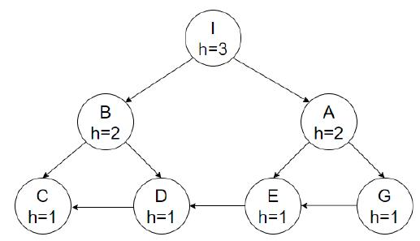
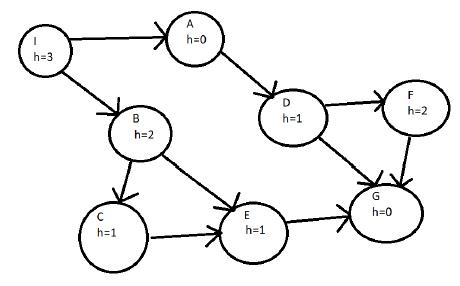
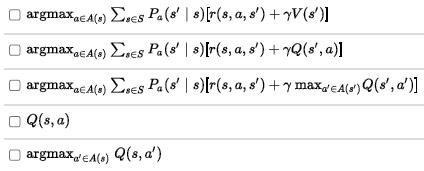
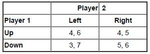
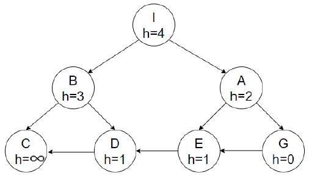
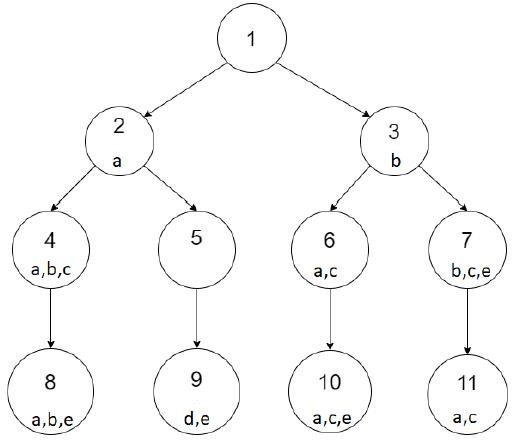
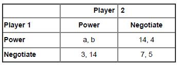
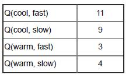

# 2022 S1 - Final

### Multiple-choice and matching questions [10 marks]

##### Q1: Which of the following statements are true?

* hff is always closer to h* than hmax or hadd ❌
* The h+ heuristic is sometimes inadmissible for all STRIPS planning problems ❌
* The A* algorithm will always return an optimal solution without reopening nodes if the heuristic used is consistent and admissible ✔
* Enforced hill climbing is complete if the heuristic used is admissible ❌
* Depth first search has a lower space complexity than breadth first search or A* ✔

##### Q2: We wish to use the GBFS algorithm to traverse the search tree below. Assume a fixed cost of 1 to transition between nodes and assume that ties are broken alphabetically, i.e. If node f(M) = f(N) then M will be expanded first. The first node to be expanded will be the initial node I. Which will be the parent node of the 4th node expanded?

##### I -> A -> E -> D -> C -> G	E

##### Q3: Assume the initial state is I, the goal state is G, and all edges have cost 1. Which connection needs to be removed from the following graph to make the heuristic admissible:

##### Remove F->G since 2 > 1

##### Q4&5: 

##### All actions have cost=1. The following actions are available

Action One:
- Precondition: completed(A)
- Add: completed(B)

Action Two:

- Prec: completed(B), Completed(D)
- Add: completed(C)

Action Three:

- Prec: completed(B), Completed(A)
- Add: completed(C)

Action Four:

- Prec: completed(C), Completed(B)
- Add: completed(E)

Action Five:

- Prec: completed(C), Completed(D)
- Add: completed(E)

Compute the values of the next row, given the actions above. Update first the value of Completed(B), then Completed(C), and finally Completed(E), in that order. If you change the value of predicate Completed(B), then you can use this value in the computation of the next predicates: Completed(C) and Completed(E).

##### Below is the Bellman-Ford Table of hmax(I) for a particular problem where I = {completed(D)} is the initial state of the problem.

| competed(A) | competed(B) | competed(C)       | competed(D) | competed(E)       |
| ----------- | ----------- | ----------------- | ----------- | ----------------- |
| 2           | Infinity    | Infinity          | 0           | Infinity          |
| 2           | 2 + 1 = 3   | max(3, 2) + 1 = 4 | 0           | max(4, 0) + 1 = 5 |

##### The value of hmax ( { completed(C), completed(E) } ) = max(4, 5) = 5

##### Below is the Bellman-Ford Table of hadd(I) for a particular problem where I is the initial state of the problem.

| competed(A) | competed(B) | competed(C)     | competed(D) | competed(E)      |
| ----------- | ----------- | --------------- | ----------- | ---------------- |
| 4           | Infinity    | Infinity        | 2           | Infinity         |
| 4           | 4 + 1 = 5   | (5 + 2) + 1 = 8 | 2           | (8 + 2) + 1 = 11 |

##### Q6: Consider a policy pi that takes a state and action, and returns the probability that action a should be chosen at state s. What type of policy is this?

* A random policy
* A strong policy
* A deterministic policy
* A local policy
* A stochastic policy ✔

##### Q7: What of the following are correct formula for policy extraction from a Q-function Q(s,a)? Select all correct answers.

##### 

##### 1

##### Q8: What is the difference between reward shaping and Q-function initialisation?

* In reward shaping the potential function is used in the update, while in Q-value initialisation, the potential is calculated in the initial step ✔
* Nothing -- they are equivalent
* Reward shaping uses potential functions while Q-function initialisation uses real functions
* Reward functions work for any Q-function representation, while for Q-function initialisation it must be a Q-table representation

##### Q9: Backward induction and multi-agent MCTS are both techniques for solving extensive form games. Under which circumstances would you choose to use backward induction instead of multi agent MCTS? Select ALL answers that apply.

* If an optimal solution is needed
* If the environment is not one of the players
* If there are only two players
* If the game tree is small enough to solve the problem exhaustively ✔

##### Q10: Select all pure-strategy Nash equilibria for the following game. Select none if there are no pure-strategy Nash equilibria.

##### 

##### (4, 6)

### Short answer questions [14 marks]

##### Q11 (3pts):

##### Assume a cost of 1 to move between nodes, initial state I, and Goal state G. With reference to the diagram above, you cannot change the heuristic values, but you can add or remove edges and add nodes with an associated heuristic value of your choice. Which nodes (with their h value) and edges do you need to add so the heuristic becomes:

**(i) Safe**
**(ii) Admissible**
**(iii) Consistent**
**(iv) Goal aware**

##### For each property, explain which nodes/edges you need to add to the graph. If you add new nodes/edges, explain why they are needed. If some property is unachievable, explain why.

(i) Reverse the direction of the two edges: G->E, E->D. B, D, E will therefore have a path to goal. C will still have h = infinity.

(ii) h(I) = 2, h(A) = 1

(iii) h(D) = 2

(iv) Already goal aware

##### Q12 (3pts):

##### Assume that the domain only includes the following five propositions {a,b,c,d,e}. With reference to the diagram above, answer the following questions:

##### (i) Assuming the goal node is Node 9, specify a set of two propositions that could hold true in Node 5 that would allow IW(1) to find the goal node.

##### (ii) Assuming the goal node is Node 9, specify one proposition that could hold true in Node 5 that would allow IW(2) but not IW(1) to find the goal node.

##### (iii) Assuming the goal node is Node 9, specify a set of two propositions that could hold true in Node 5 that would not allow either of IW(2) or IW(1) to find the goal node.

##### Note that a node's numeric label indicates the order it is considered for generation and expansion. Each character denotes a proposition, e.g. node 2 has a state which contains only the proposition a.

(i) {a, e}

{ii} {d}

(iii) {a, d, e}

##### Q13 (3pts):

##### Consider a robot called *MedAssist*, which takes medical kits from their storage location to an operating theatre in a hospital. When it is not being used, it stays at its base station to charge.

##### It can be in one of five states:

1. Base: It is at its base station
2. No Kit: It is not at its base station and does not have a medical kit
3. Kit 1: It has collected medical kit 1
4. Kit 2: It has collected medical kit 2
5. Delivered: It has delivered a medical kit 1 or 2

##### There are three actions available:

1. *get_kit1*: MedAssist goes to collect medical kit 1. If kit 1 is there, the MDP transitions to state *Kit 1*. If kit 1 is missing, the MDP will stay in state *No Kit*. No immediate reward is received.
2. *get_kit2*: MedAssist goes to collect medical kit 2. There is a 1.0 chance kit 2 will be there (transition to state *Kit 2*). No immediate reward is received.
3. *deliver*: Deliver the kit that is being carried

##### The MDP transition probabilities and rewards are:

|   s    |    a     |    s'     | P(s, a, s') | r(s, a, s') |
| :----: | :------: | :-------: | :---------: | :---------: |
|  Base  | get_kit1 |  No Kit   |     0.8     |      0      |
|  Base  | get_kit1 |   Kit 1   |     0.2     |      0      |
|  Base  | get_kit2 |   Kit 2   |     1.0     |      0      |
| No Kit | get_kit2 |   Kit 2   |     1.0     |      0      |
| Kit 1  | deliver  | Delivered |     1.0     |     10      |
| Kit 2  | deliver  | Delivered |     1.0     |      5      |

##### Using value iteration, we end up with the following value function for *MedAssist* after four iterations using a discount factor γ = 0.9.

| State | Base | No Kit | Kit 1 | Kit 2 | Delivered |
| :---: | :--: | :----: | :---: | :---: | :-------: |
| Value | 2.6  |   2    |   9   |   6   |     0     |

##### Apply one more iteration to calculate the value V(Base) after five iterations.

##### Enter your final answer to two decimal places in the box below

Q(Base, get_kit1) = 0.8 * [0 + 0.9 * 2] + 0.2 * [0 + 0.9 * 9] = 3.06

Q(Base, get_kit2) = 1 * [0 + 0.9 * 6] = 5.4

V(Base) = max(3.06, 5.4) = 5.4

##### (Q14 unavailable) 1pts

##### Q15 (3pts): Consider two players in a role-playing game, who have different skills available to them. On some turns in the game, the players need to compete for a resource. They can either choose to use their *Negotiate* strategy or use their *Power* strategy. The payoffs resulting from the *Power* strategy depend on the particular power of both of the players (those payoffs are represented by a and b below). The game can be represented using the following normal form matrix:

##### Consider situation in with both players have the same *Power* strategy as each other, so a=b. What is the smallest value of a that gives both players a strictly dominant strategy?

a = 4

##### Q16  (2pts): In your own words, compare on-policy reinforcement learning and off-policy reinforcement learning. When would you use one over the other? Keep your answer short: this question is worth only 2 marks.

An off-policy, whereas, is independent of the agent’s actions. It figures out the optimal policy regardless of the agent’s motivation.

On-policy methods attempt to evaluate or improve the policy that is used to make decisions.

If we have no prior experience about the task, off-policy methods are better.

If we want to learn on the existing job, on-policy methods are better.

##### Q17  (1pts): Consider a reinforcement learning agent this is try to learn how fast a vacuum cleaning robot can travel without over-heating.

##### There are two states: cool and warm.

##### There are two actions: slow and fast.

##### If the robot goes fast, it is more likely to transition to a warm state than it is goes slow.

##### Using reward shaping, we aim to keep the agent in the cool state to avoid overheating, so we define a potential reward functions: Φ(cool) = 1 and Φ(warm) = 0.

##### Using a learning rate of 0.4 and a discount factor of 0.7, we arrive at the following Q-table:

##### 

##### The agent executes the action fast in the state cool, receives a reward of 6.0, and is now in the warm state. It will execute the action slow next.

##### Calculate the new value for Q(cool, fast) using Q-learning.

Q(cool, fast) = 11 + 0.4 * (6 + 0 + 0.7 * Q(warm, slow) - 11) = 10.12

### Long answer questions [16 marks]

##### Q18 (7pts): Consider an AI agent for trading financial securities. Each day, the agent needs to make the decision whether to buy or sell some of its holdings. The payoff depends on whether the market wants to buy or sell on those days.

##### The agent has the following information:

* If I decide to sell and the other traders buy, my utility will increase by \$5 million dollars. The market's happiness will increase by \$2 million.
* If I decide to buy and the other traders try to buy too, my utility will be \$0. The other market's happiness will be \$4 million though, because they keep their money to spend on other securities.
* If I decide to sell and the other traders try to sell too, my utility will decrease by \$1 million because I wasted my time and sold nothing. The market's happiness will be \$3M, because they still get to keep their money.
* If I decide to buy and the other traders sell, my utility will increase by \$1 million dollars. The market's happiness will be \$2 million.

##### All of the traders in the market, including the agent, need to submit their bids at the start of the day without seeing each other's bids.

##### What will be equilibrium of this situation be? Show your working.

|           | Traders |        |
| --------- | ------- | ------ |
| **Agent** | Sell    | Buy    |
| Sell      | (1, 3)  | (5, 2) |
| Buy       | (1, 2)  | (0, 4) |

Equilibrium: The agent and the other traders both sell -> (1, 3)

##### Q19 (4pts): Create a STRIPS problem with <u>at most three actions</u> such that hmax(I, G) < hFF(I, G).

##### Specify your STRIPS actions using the following notation: \<action name\> : preconditions -> effects.

##### For example, action a: p, q -> r, not t, would stand for action a, where p and q are the preconditions, and the effects add r and delete t.

##### To answer this question, show your workings by 1) creating the STRIPS problem, 2) finding the value of hmax(I), and 3) then the value of hff(I) using the best supporter function induced by hmax. You then be able to show that hmax(I, G) < hFF(I, G)

"Logistic" problem

##### Actions:

* drive(X, Y): truck(X) -> truck(Y), ~truck(X)

* load(X): package(X), truck(X) -> package(truck), ~package(X)

* unload(X): package(T), truck(X) -> package(X), ~package(truck)

##### Problem:

* initial state I: truck(A), package(C)
* Goal state G: truck(D), package(A)

##### hmax Table:

|                 | t(A) | t(B) | t(C)  | t(D)  | p(T)  | p(A)  | p(B)    | p(C) | p(D)    |
| --------------- | ---- | ---- | ----- | ----- | ----- | ----- | ------- | ---- | ------- |
| hmax | 0    | 1    | 1+1=2 | 2+1=3 | 2+1=3 | 3+1=4 | 3+1+1=5 | 0    | 3+3+1=7 |

hmax(I, G) = max(3, 4) = 4

##### Extracting a relaxed plan:

|                  | t(A) | t(B)    | t(C)    | t(D)    | p(T)  | p(A)  | p(B)  | p(C) | p(D)  |
| ---------------- | ---- | ------- | ------- | ------- | ----- | ----- | ----- | ---- | ----- |
| bsmax | /    | dr(A,B) | dr(B,C) | dr(C,D) | lo(C) | ul(A) | ul(B) | /    | ul(D) |

1. bs(t(D)) = dr(C,D), opens t(C)
2. bs(t(C)) = dr(B,C), opens t(B)
3. bs(t(B)) = dr(A,B), opens nothing
4. bs(p(A)) = ul(A), opens p(T)
5. bs(p(T)) = lo(C), opens nothing

Therefore, hFF(I, G) = 5 > hmax(I, G)

##### Q20 (5pts): A robot (R) has to install electricity cables connecting a single generator G into a set of consumers C0 , . . . , Cn over a square grid of size MxM. Consumers and the Generator cannot be located in the same cell in the grid. The robot always starts at cell 0,0 in the grid, i.e. left-bottom of the grid, and can <u>move</u> to any adjacent location. The robot installs a cable line into the same cell it is located. The robot <u>starts installing</u> electricity cable only into a position adjacent to the generator, and then it can extend the line to adjacent cells until each consumer i is <u>activated</u>. A consumer i is activated if it has an adjacent cell containing an electricity line.

##### Describe briefly in STRIPS or PDDL how to model the domain described.

##### We expect to see the following actions modeled: move, start_line, extend_line and activate_connection.

##### Include a specification of the parameters of the actions, and the preconditions and postconditions of each action.

##### Include a description of the goal state of the problem for 2 consumers, and create 1 possible initial state where the goal is reachable. Explain clearly any assumption made.

##### You are allowed to use variables as arguments for the actions (action schemes), specifying the values of the variables. Note: it is not compulsory to use PDDL syntax, as long as you can convey the main ideas.

##### Assumptions

* Cells are numbered for simplicity, for example, (0, 0) = Cell(1), (M, M) = Cell(M^2)
* at(x) - Robot is at Cell(x)
* adj(x, y) - Cell(x) and Cell(y) are adjacent
* adjG(x) - Cell(x) is adjacent to a generator
* adjC(x, c) - Cell(x) is adjacent to consumer c
* line(x) - Cell(x) has an electricity line
* act(c) - Consumer c is activated

##### Actions

* move(x, y): Move the robot from cell x to cell y
  * prec = {at(x), adj(x, y)}
  * add = {at(y)}
  * delete = {at(x)}
* start_line(x): The robot starts installing electricity cable at Cell(x)
  * prec = {at(x), adjG(x), not line(x)}
  * add = {line(x)}
  * delete = {}
* extend_line(x, y): The robot extends the line from Cell(x) to Cell(y)
  * prec = {at(x), not line(y), line(x)}
  * add = {line(y), at(x)}
  * delete = {at(y)}
* activate_connection(x, y): The robot activates the Consumer in Cell(y) at Cell(x)
  * prec = {at(x), adjC(x, c), not act(c)}
  * add = {act(x)}
  * delete = {}

##### Goal state

* act(c) is true for all consumers
* c is a variable representing consumers

##### Initial state

* The robot is initially at cell 0,0 -> at(Cell0)
* Indicate connections of cells, assuming a 3*3 grid
  * adj(Cell0, Cell1), adj(Cell1, Cell2), etc.
* Indicate cells that are adjacent to generators, assuming there is only one generator which is at right-top of the grid (2, 2).
  * adjG(Cell5), adjG(Cell7)
* Initialise consumers, assuming there are 2 consumers c1 and c2
* Indicate cells that are adjacent to consumers
  * adjC(2, c1), adjC(5, c1), adjC(3, c2), adjC(7, c2)

