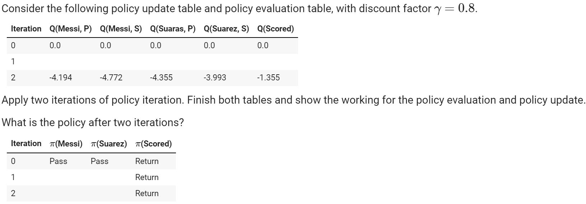

# Messi & Suarez

### Background

Consider two football-playing robots: Messi and Suarez.
They play a simple two-player cooperate game of football, and you need to write a controller for them. Each player can pass the ball or can shoot at goal.

The football game can be modelled as a discounted-reward MDP with three states: *Messi, Suarez* (denoting who has the ball), and *Scored* (denoting that a goal has been scored); and the following action descriptions: 

* If Messi shoots, he has 0.2 chance of scoring a goal and a 0.8 chance of the ball going to Suarez. Shooting towards the goal incurs a cost of 2 (or a reward of -2).
* If Suarez shoots, he has 0.6 chance of scoring a goal and a 0.4 chance of the ball going to Messi. Shooting towards the goal incurs a cost of 2 (or a reward of -2).
* If either player passes, the ball will reach its intended target with a probability of 1.0. Passing the ball incurs a cost 1 (or a reward of -1).
* If a goal is scored, the only action is to return the ball to Messi, which has a probability of 1.0 and has a reward of 2. Thus the reward for scoring is modelled by giving a reward of 2 when leaving the goal state.

The following diagram shows the transition probabilities and rewards:

### Tutorial 7: MDP, Value iteration

#### Problem 1:

#### Problem 2:

##### Complete the values of these states for iteration 3 using value iteration. Show your working.

### Tutorial 8: Temporal difference learning

#### Problem 1:

##### Explain the difference between Sarsa and Q-learning.

The difference between SARSA and Q-learning is that Q-learning is off-policy learning, while Sarsa is on policy learning. Essentially, this means that SARSA chooses its action using the same policy used to choose the previous action, and then uses this difference to update its Q-function; while Q-learning updated assuming that the next action would be the action with the maximum Q-value.

Q-learning is therefore "optimistic", in that when it updates, it assumes that in the next state, the greedy action will be chosen, even it may be that in the next step, the policy, such as ϵ-greedy, will choose to explore an action other than the best.

SARSA instead knows the action that it will execute next when it performs the update, so will learn on the action whether it is best or not.

#### Problem 2: Q-learning

#### Problem 3: SARSA

#### 

### Tutorial 10: Policy iteration and reward shaping

#### Problem 1: Policy update

