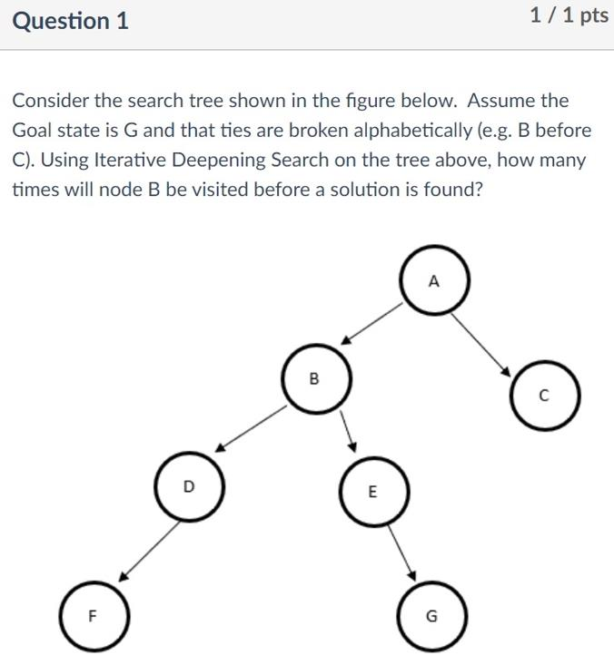
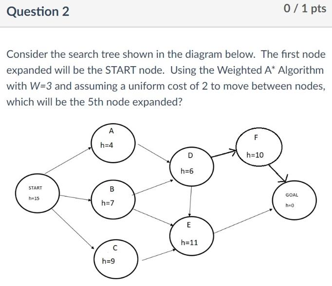
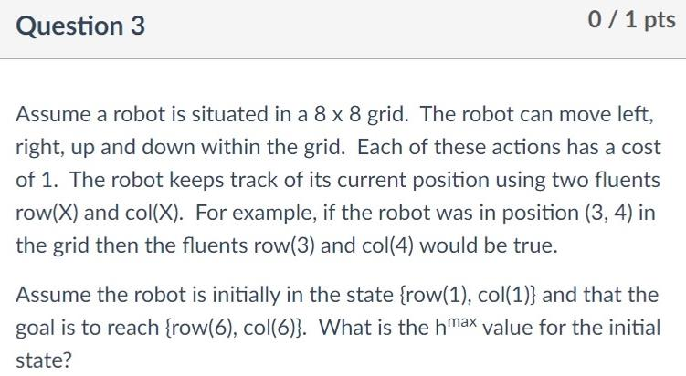
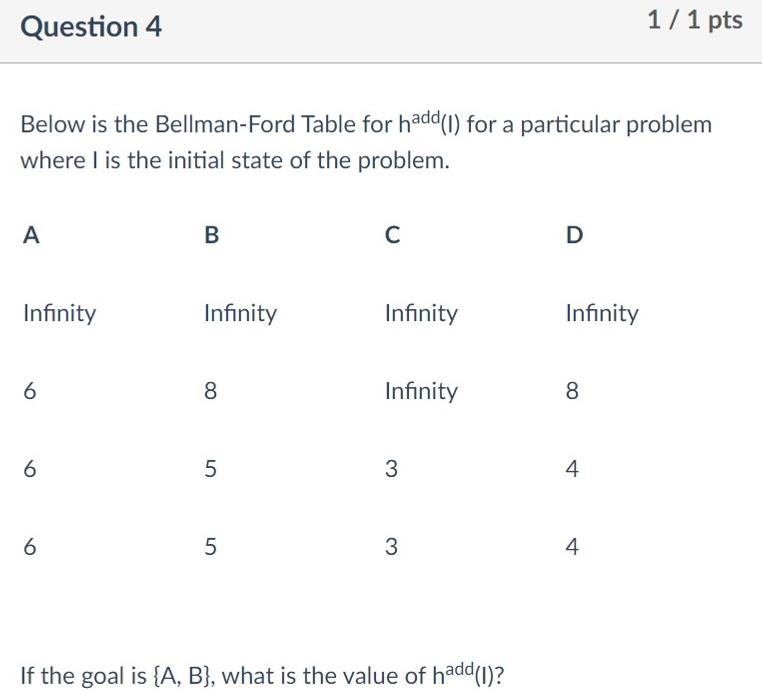
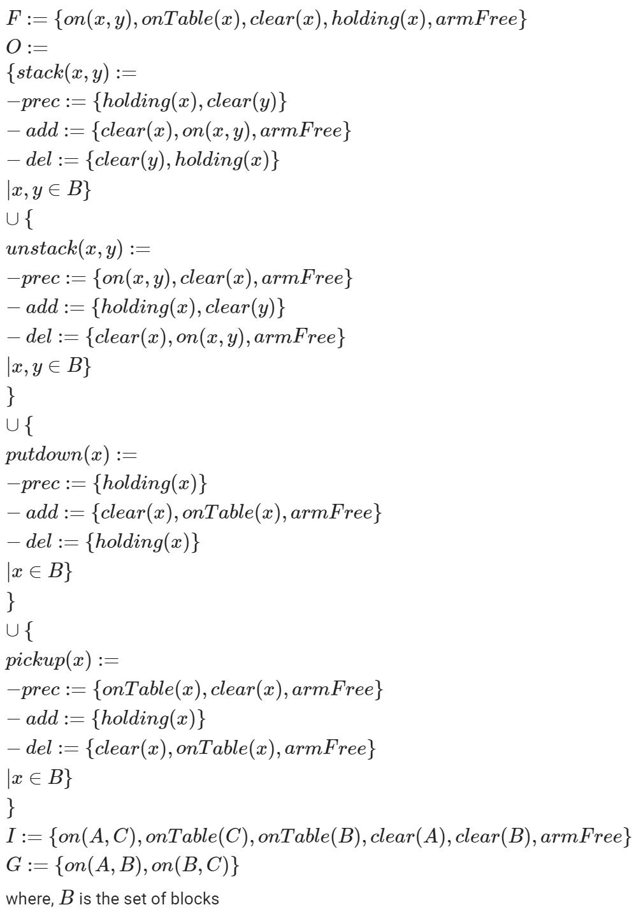

# Mid-Semester Test

##### 

##### 3 times

##### 

##### C	(The first node expanded is the START node)

##### 

##### Max(5, 5) = 5

##### 

##### 6 + 5 = 11

#### Q5: The h+ heuristic can be calculated by:

* Solving the delete relaxed problem using a satisficing planner
* Taking the average of the hadd and hmax heuristics
* Solving the original problem using a satisficing planner
* Solving the delete relaxed problem using an optimal planner ✔
* Counting the number of goal atoms are not true in the current state

#### Q6: Consider a heuristic function that sets the heuristic value for each state to zero (i.e. the behavior of the null Heuristic from your first assignment). For all search problems with positive action costs, this heuristic is:

* Admissible, Consistent and Goal Aware, but not necessarily safe
* Admissible, Consistent and Safe, but not necessarily Goal Aware
* Admissible, Goal Aware and Safe, but not necessarily Consistent
* Consistent, Goal Aware and Safe, but not necessarily Admissible
* Admissible, Goal Aware, Safe and Goal Aware ✔
* None of the other answers

#### Q7: Which of the following statements are true (select all that apply)?

* All safe heuristics are goal aware
* The h+ heuristic is admissible for all search problems ✔
* Breadth first search is complete for all search spaces ✔
* The goal counting heuristic is admissible for all search problems
* Iterative Deepening Search is complete for all search spaces ✔
* The hadd heuristic is admissible for all search problems

#### Q8: Which of the following statements are true (select all that apply)?

* Satisficing plans are generally more difficult to compute than optimal plans
* Both PlanLen and PlanEx are PSPACE-complete in general ✔
* The relaxation produced by removing preconditions and delete lists form a STRIPS planning problem is efficiently computable
* The relaxation produced by removing delete lists from a STRIPS planning problem is efficiently constructable ✔
* Any STRIPS planning problem can be modelled using PDDL ✔

#### Q9: Consider the Pacman domain used in your first assignment, where the goal is to eat all of the food on the map. Imagine that eating a food dot caused Pacman to move one of the unoccupied adjacent nodes (e.g. the one above, below, left or right of the current position), with an equal probability of moving to any of those nodes. This could best be modelled as:

* A Markov Decision Process ✔
* A Partially Observable Markov Decision Process
* A Boolean Satisfiability Problem
* A Classical planning problem

#### Q10: Consider the well-known blocks world domain used in lectures. When modelled using STRIPS, how many predicates will appear in the delete list for the *pickup* action?

##### 3 (clear(x), onTable(x), armFree)

#### Functions of the blocks world (From Tutorial 4)

