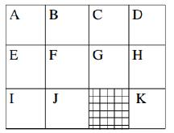
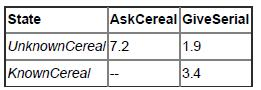
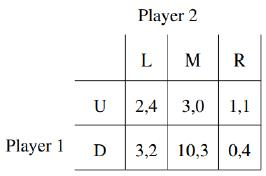
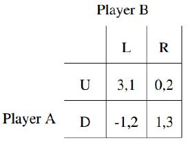

# Practice Exam Quiz

### Blind and heuristic search

##### Q1: The following search algorithms can be implemented in a similar manner, differing only in the abstract data structure used to implement the open list.

##### State which abstract data structure you would use for each of them. Briefly explain, in one or two sentences, why you would choose the particular data structure.

* Breath First Search
  * Use a queue. Newly generated nodes will be push to the back of the queue. Nodes with lower depth will be expanded first.
* Depth First Search
  * Use a stack. Newly generated nodes will be explored first to dive deeper.
* Uniform Cost Search
  * Use a priority queue, which sort the nodes based on their cost. Node with the minimum cost will be  expanded first.

##### Q2: Recall that A* requires a consistent heuristic to guarantee finding an optimal plan without reopening nodes. Draw or define a graph and make up an admissible but inconsistent heuristic function where A* returns a suboptimal solution.

##### Write down the steps involved in the A* algorithm by devising a simple example to illustrate.

##### Note: avoid making large examples, a graph with 4 nodes should be sufficient.

#### The next five questions refer to the following example. 

##### They concern a classical planning problem where a robot can move horizontally and vertically to adjacent cells as depicted in the figure below. Note that the robot cannot move diagonally between cells and the hashed cell is inaccessible to the robot.

##### In answering the sub-questions below, you are allowed to use variables as arguments for the actions (action schemes), specifying the values of the variables. Note: it is not compulsory to use PDDL syntax, as long as you can convey the main ideas.

##### Hint: consider that the position of the robot could be modelled as either:

* row/column tuples, e.g. \<0, 0\> could refer to the lower left cell, or
* single cells, e.g. position \<I\> could refer to the lower left cell.

##### Q3: Describe briefly in STRIPS how to model the problem where a robot can move horizontally and vertically among adjacent cells, such that the hadd heuristic estimates the same values as the Manhattan heuristic

##### Q4: Describe briefly in STRIPS how to model the problem where a robot can move horizontally and vertically among adjacent cells, such that the hadd heuristic estimates the same values as the *Optimal* heuristic.

##### Q5: Using your last STRIPS encoding where **hadd = h***, and initial state *s0 = robot at location I* and a goal state *sg = robot at location K*, compute *hadd(sg)* and *hff* from the best supporters induced by *hadd*.

##### Q6: We have 2 rooms A and B, 2 objects o1 and o2. A robot can load and unload objects if the robot is at the same location, and move from one room to the other. We want to get o1 and o2 into room B, given that both are initially at A.

##### Model the problem in STRIPS in such a way that the optimal plan would be the following:

pick(o1, A), move(A, B), drop(o1, B), move(B, A), pick(o2, A), move(A, B), drop(o2, B)

##### Q7: What's the *hmax(s0)* value of your STRIPS model, where *s0* stands for the initial state?

### MDPs and reinforcement learning

#### The following questions refer to this example

##### Imagine a kitchen robot whose task is to ask the user what kinds of cereals he/she wants for breakfast, wait for the user answer, and then hand out the appropriate cereal box once it knows the desired cereal. We want to design a simple dialogue system to handle the interaction with the user.

##### A simple way to model it is via a discount-reward MDP with only two states: UnknownCereal, where the robot does not know which cereal to give, and KnownCereal, where the robot knows the cereal to hand out.

##### There are only two possible actions in the model:

* Action *AskCerealType* corresponds to the robot asking the user for the cereal box he/she wishes to have. The action is only available in state *UnknownCereal*, and has a reward of -1 (a cost) in that state. The probability of reaching state *KnownCereal* is 0.8 (if the user answers the robot’s question), and otherwise (probability 0.2) the robot remains in *UnknownCereal* (if the user ignores the question or provides an unclear answer).
* Action *GiveCereal* corresponds to the robot physically giving the cereal to the user. The action is available in the state *KnownCereal*, and has a reward of 5. When the robot executes this action in state *KnownCereal*, the MDP reaches an absorbing goal state and finishes. As such, there is no actions or reward available from this absorbing goal state. When the robot executes this action in the *UnknownCereal* state, the MDP reaches the absorbing goal state with probability 0.3 (it gets lucky and hands the right cereal) and receives a reward of 5, or the person rejects the cereal and the robot goes back to the *UnknownCereal* state with probability 0.7 and receives a reward of -2.

##### Q8: Assuming a discount factor γ = 0.9, calculate the the value function *V* for each of the states *UnknownCereal* and *KnownCereal* using value iteration, for the 2nd and 3rd iterations. Show your working.

##### Iteration 1:

* V(KnownCereal) = 0.0
* V(UnknownCereal) = 0.0

##### Q9: Given the value function that you calculate above, what policy would maximise the robot’s expected reward? Show your working.

##### Q10: In your own words, explain the difference between value iteration and policy iteration.

##### Q11: The robot designers have found that the probabilities used for outcomes are incorrect and different for each household. As such, they decide to instead use reinforcement learning to learn the policy after deployment.

##### A few weeks after deployment, one such robot has the following Q-table:

##### Assuming a discount reward factor of 0.9 and a learning rate of 0.5.

##### In the state *UnknownCereal*, the robot executes *GiveCereal*, which is rejected. It decides to execute *GiveCereal* again.

##### Update the Q-table using both the Q-learning and SARSA updates for the first *GiveCereal* action. That is, calculate two new Q-tables. Show your working.

##### Q12: The robot designers are finding that the owners of the robots are demanding are fund because the robots get their cereal preference wrong too often. Give one technique that the robot designers could do to improve the situation.

##### Q13: Imagine a reinforcement learning algorithm that monitors heart beat information from a fitness device, such as a FitBit, to determine whether a person develops a heart problem, such as an irregular heartbeat or a faster heartbeat.

##### List one potential ethical dilemma that could occur in such a situation. Justify why you believe this could be a serious problem.

### Game theory

##### Q14: Consider the following abstract two-player game in normal form. Find all pure and mixed-strategy equilibria for this game. Show your working.

##### 

##### HINT: Consider the notion of dominated strategies, in which some strategies are strictly dominated by others, so can be discarded.

##### Q15 (Challenge Question): Two players, A and B play the following game.

##### First A must choose IN or OUT.

##### If A chooses OUT the game ends, and the payoffs: are A gets 2, and B gets 0.

##### If A chooses IN then B observes this and must then choose IN or OUT.

##### If B chooses OUT the game ends, and the payoffs are: B gets 2, and A gets 0.

##### If B chooses IN then they play the following simultaneous move game:

##### 

##### Draw the extended-form tree for this game and calculate the equilibria of the extended-form game.

##### Note: to 'draw' the tree, you can use text format; e.g.

* U -1.a-> X
* X -2.b-> Y (0,1)
* X -2.c-> Z (1,0)

##### represents a true with root node U. From U, player 1 must select move a, and the player 2 chooses between moves b and c

##### Q16 (Challenge Question): Consider a person who is mugged by someone on the street with a gun. The person has an unloaded gun in their own pocket. They could get the gun out to try to scare off the mugger, however, they risk the mugger shooting them instead. If they do not get out the unloaded gun, their mugger has time to search only their left or right pocket, but not both and the mugger will not shoot them. The person has \$100 in their left pocket and nothing in their right pocket, and the mugger knows this. Assume that if the mugger does not get the \$100, they get no payoff. Should the person draw their unloaded gun or not? Justify your answer.