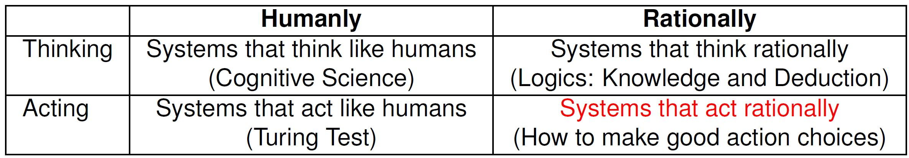

# 1 - Intro to AI and Search

#### What is Artificial Intelligence?

* Turing test
* Chinese room experiment
* Rational agents
  * Perceive the environment through sensors (percepts)
  * Act upon the environment through actuators (actions)
* Rationality vs Omniscience (全知)
  * An omniscient agent knows everything about the environment, and knows the actual effects of its actions.
  * A rational agent just makes the best of wat it has at its disposal, maximizing expected performance given its percepts and knowledge.

#### AI Solver, SAT & CSPs, Classical Planning Model	L1 P28-30

#### Why do we need such an AI

* Chesses: 2 player zero-sum game
* Music/Speech recognition
* Recommender systems
* Medical diagnosis: decision support systems
* Self-driven car
* Playing Atari Games: deep learning

#### Why do we need such AI Planning

* Space Exploration
  * RAX - first artificial intelligence control system to control a spacecraft without human supervision
* Business Process Management
* First Person Shooters & Games
  * Classical planners playing Atari Games
* Interactive Storytelling
* Network Security
* Logistics/Transportation/Manufacturing
  * Multi-model Transportation, forest fire fighting, PARC printer
* Warehouse Automation
  * Multi-Agent Path Finding, Post China, Amazon
* Automation of Industrial Operations (Schlumberger)
* Self Driving Cars

#### Summary

* A research agenda that has emerged in last 20 years: solvers for a range of intractable models.
* Solvers unlike other programs are general as they do not target individual problems but families of problems (models).
* The challenge is computational: how to scale up
* Sheer size of problem shouldn't be impediment to meaningful solution
* Structure of given problem must recognized and exploited
* Lots of room for ideas but methodology empirical
* Consistent progress
  * effective inference methods (derivation of h, conflict-learning)
  * islands of tractability (treewidth methods and relaxations)
  * transformations (compiling away incomplete info, extended goals, ...)

