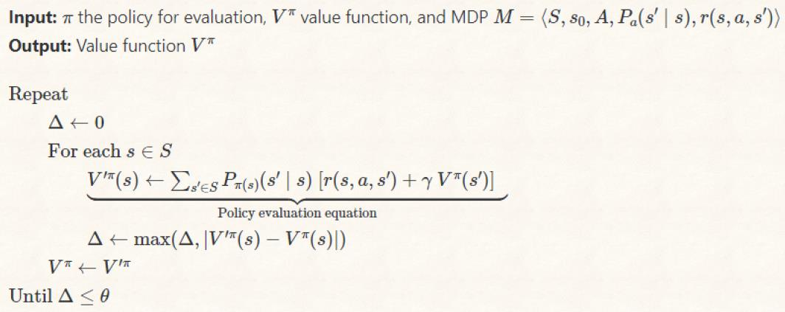
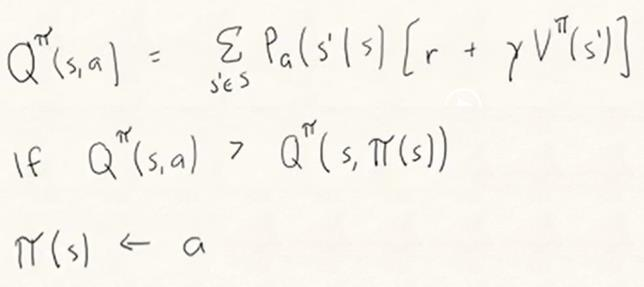
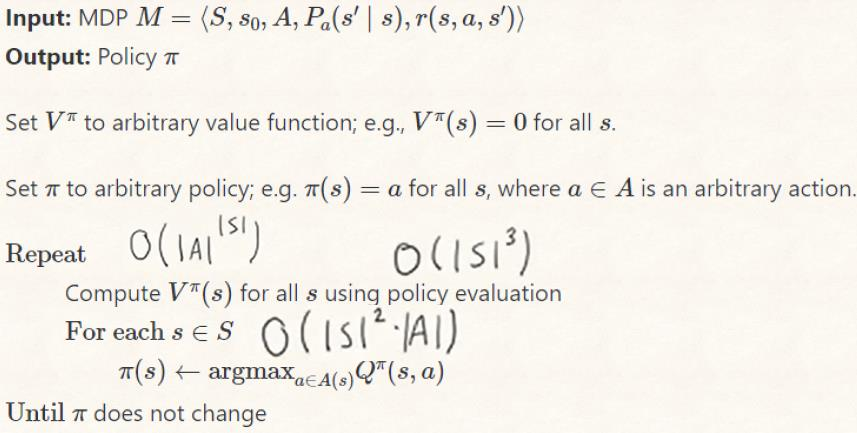
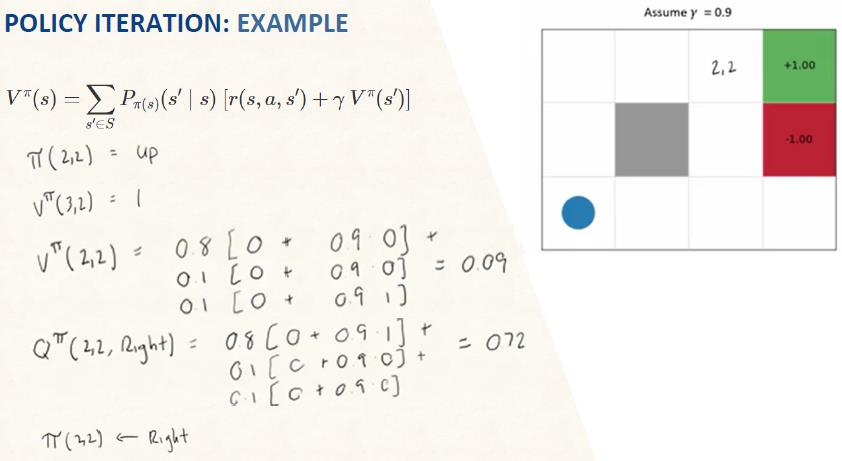
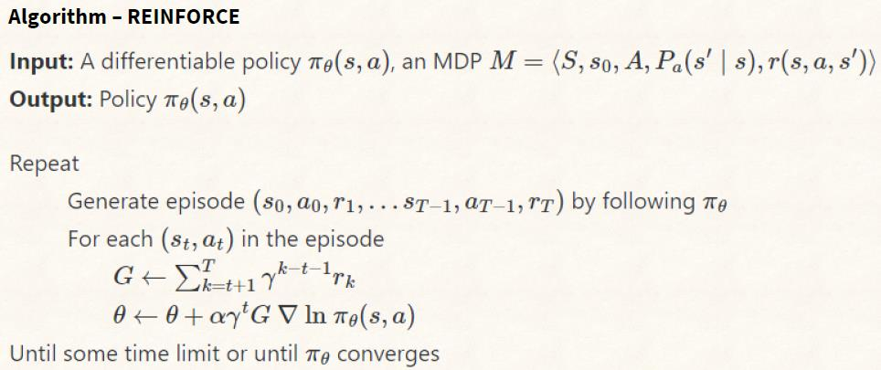
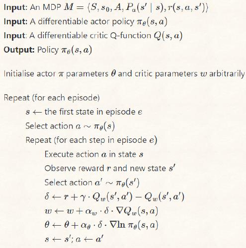

# 10 - Policy Iteration & Policy Gradients

## 知识点 & [题目](#题目)

#### Policy Evaluation

#### Policy Improvement

#### Policy Iteration

#### Policy Gradients

* Continuous action space
* G: estimate of Q(s,a)
  * Instability
* Generally converge to local optima

#### Q Actor Critic

* Replace G with TD estimate -> more stable -> converge
* Critic: feedback on actions

## 题目