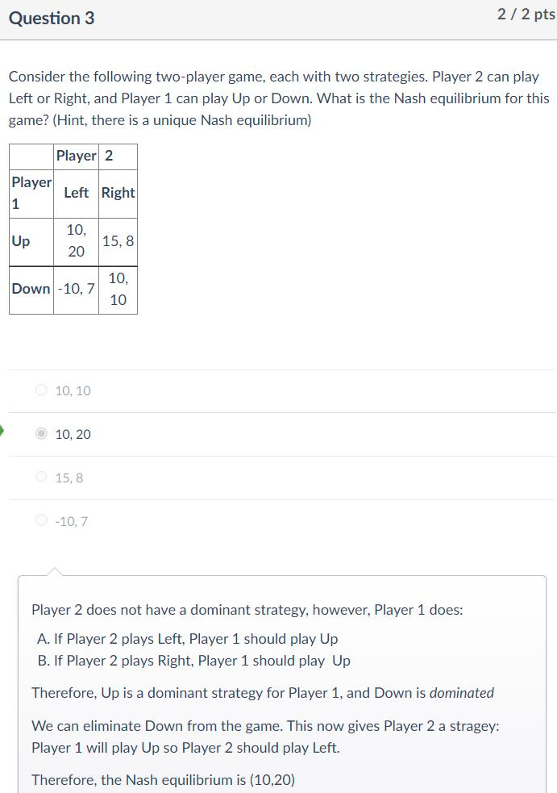
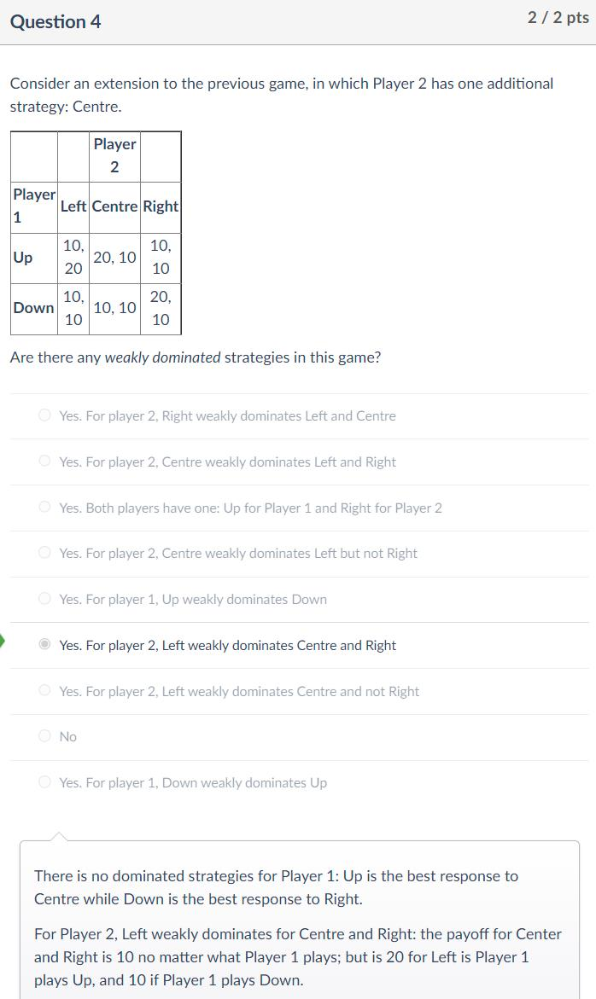
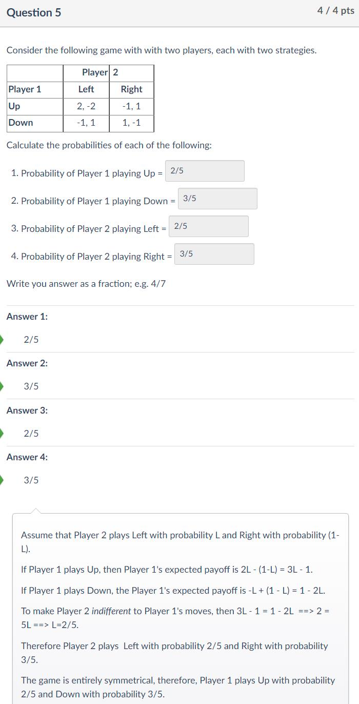
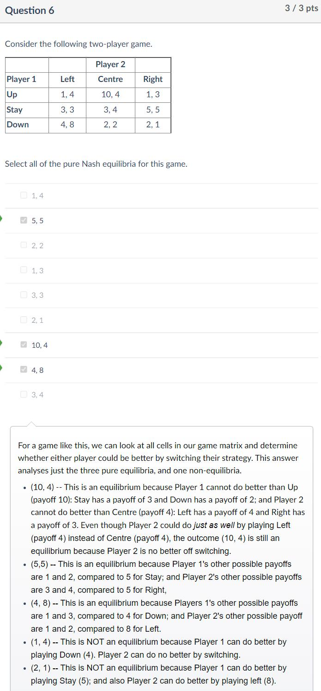
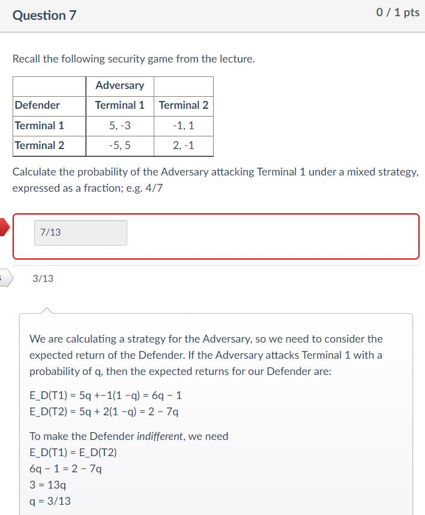

# 11 - Normal-Form Games

## 知识点 & [题目](#题目)

#### Definition	L11 P5

##### Assumptions

* Agents are rational, self-interested and have perfect information
* Agents make simultaneous moves

#### Best Response & Nash Equilibria	L11 P7

#### Examples

* Prisoner's Dilemma
* The Advertising Game    P9
  * Firm 1 is likely to not advertise
  * Firm 2 can decide based on Firm's possible choice
* Split or Steal    P10
  * Weak equilibria (0, 0) -> Multiple equilibria
* Matching Pennies    P16
  * No pure equilibria
  * Mixed Strategy Equilibria -> Security Games

## 题目

### Quiz

Q1: If all players have a weakly dominant strategy in a game, then there exists a unique Nash equilibria

* The answer is false. 

* If all players have a *strictly* dominant strategy in a game, then there exists a unique Nash equilibria.
* However, if at least one player has only a dominant (or *weakly dominant)* strategy, then there may be multiple Nash equilibria.

Q2: Which of the following is correct?

* A pure strategy is also a mixed strategy ✔
  * A pure strategy is simply a mixed strategy where one of the underlying strategies has a probability of 1, and all others have a probability of 0.
*  Pure strategy equilibria always exist
* Mixed strategy equilibria only exist for two-player games
* A mixed strategy is also a pure strategy

