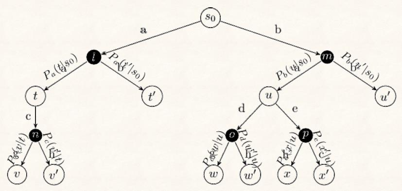
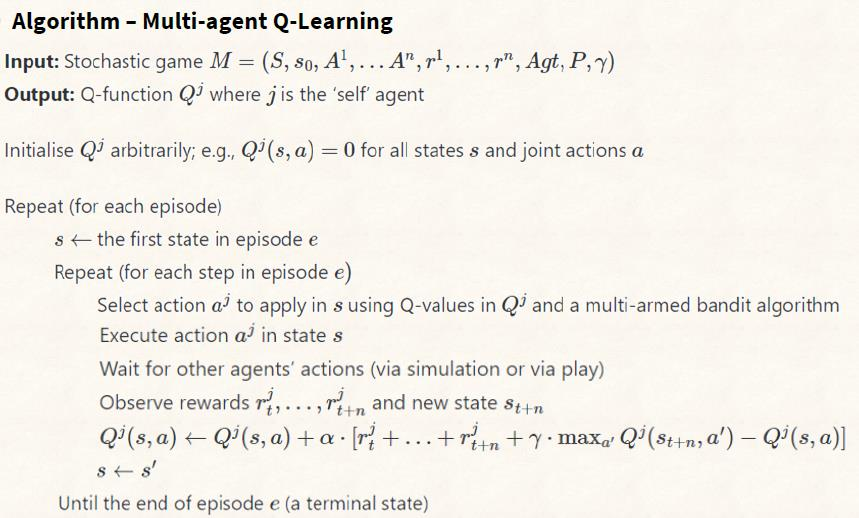
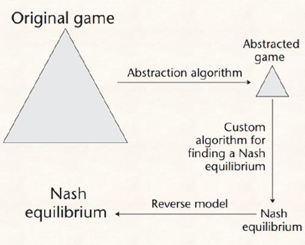
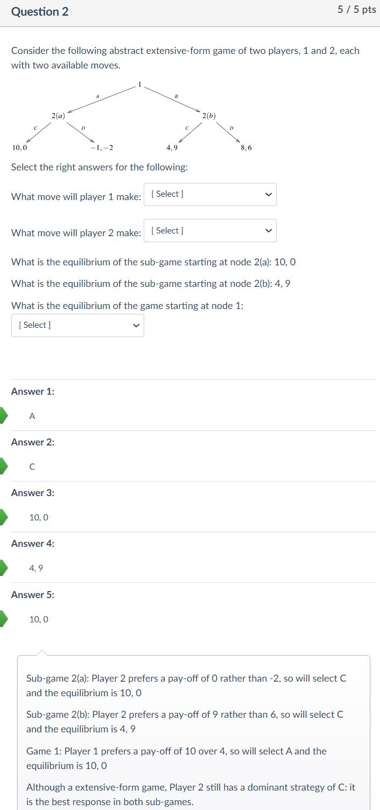
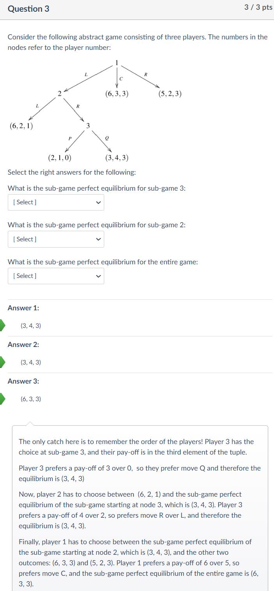

# 12 - Extensive-Form Games

## 知识点 & [题目](#题目)

#### Definition	L12 P3

* Similar to normal-form games
  * Agents are rational, self-interested and have perfect information
* Agents do not have simultaneous moves

#### Backward Induction

* Named as **Minimax** in zero-sum games
* Find **sub-game perfect equilibria (SPE)** and construct the **equilibria path**
* Buyer/Seller Game    P4
* The Advertising Game    P6
* Tic-Tac-Toe    P7

#### Multi-Agent Reinforcement Learning

##### Simulating Opponent moves

* Random selection
* Fixed policy
  * Hand coded: Not great but reasonably good
  * Learned policy
* Self play

##### Multi-Agent MCTS	P11

##### Application: Poker

## 题目

### Quiz

Q1: Extensive-form games differ to normal-form games in which of the following ways (only one answer is correct)?

* They do not have a Nash equilibrium
* Their Nash equilibria are never unique
* Their Nash equilibria are extensive
* They allow sequential moves ✔

Q4: Model-free reinforcement learning cannot be applied in game theory because it is model-free and game-theory would require a model of other players?

False: Model-free reinforcement learning can be applied by exploring and exploiting actions and treating the other agents' actions as uncertain outcomes of our own agent's actions.

