# 2 - Search Algorithms

## 知识点 & [题目](#题目)

#### Basic state model S(P): Classical Planning

* A solution is a sequence of applicable actions that maps s0 into SG, and it is optimal if it **minimizes sum of action costs** (e.g., # of steps)
* Different models and controllers obtained by relaxing assumptions in blue

#### Blind search vs. heuristic (informed) search:

* Blind search algorithms: Only use the basic ingredients for general search algorithms.
  * e.g., Depth First Search (DFS), Breadth-first search (BrFS), Uniform Cost (Dijkstra), Iterative Deepening (ID)
* Heuristic search algorithms: Additionally use heuristic functions which estimate the distance (or remaining cost) to the goal.
  * e.g., A*, IDA*, Hill Climbing, Best First, WA*, DFS B&B, LRTA*, . . .
* For satisficing planning, heuristic search vastly outperforms blind algorithms pretty much everywhere.
* For optimal planning, heuristic search also is better (but the difference is less pronounced).
* Blind search does not require any input beyond the problem.
  * Pro: No additional work for the programmer.
  * Con: It’s not called “blind” for nothing . . . same expansion order regardless what the problem actually is. Rarely effective in practice.
* Informed search requires as additional input a heuristic function h that maps states to estimates of their goal distance.
  * Pro: Typically more effective in practice.
  * Con: Implement h.
  * Note: In planning, h is generated automatically from the declarative problem description.

#### Systematic search vs. local search

* Systematic search algorithms: Consider a large number of search nodes simultaneously.
* Local search algorithms: Work with one (or a few) candidate solutions (search nodes) at a time.
* This is not a black-and-white distinction; there are crossbreeds (e.g., enforced hill-climbing).
* For satisficing planning, there are successful instances of each.
* For optimal planning, systematic algorithms are required.

#### Search Terminology

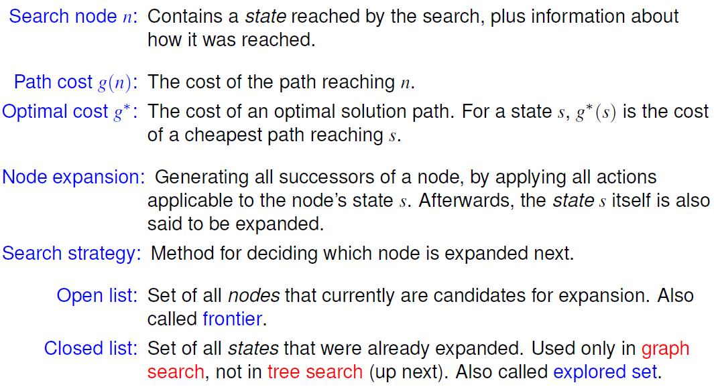

#### Search States vs. Search Nodes

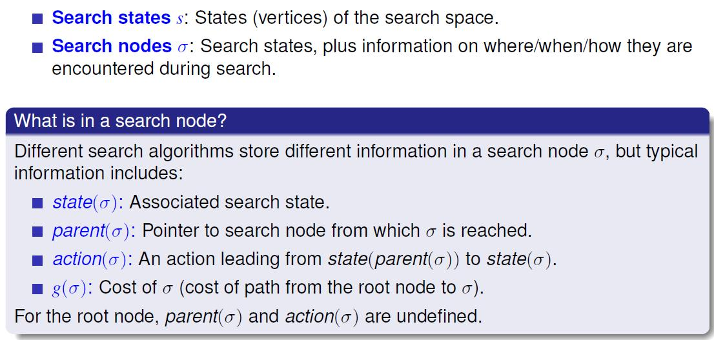

#### Criteria for evaluating search strategies

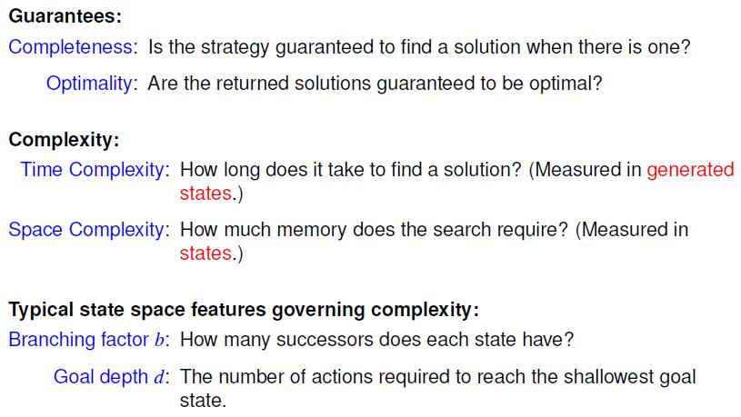

#### Blind Search

* Breadth-First Search
* Depth-First Search
* Iterative Deepening Search

#### Heuristic Search: Systematic

* Greedy best-first search
* A*
* Weighted A*
* Iterative deepening A* (IDA*)
* Bidirectional A\* Enhanced (BAE*)

#### Heuristic Search: Local

* Hill-climbing
* Enforced hill-climbing
* Beam search, tabu search, genetic algorithms, simulated annealing, . . .

#### Heuristic Function	L2 P25

* Heuristic function h estimates the cost of an optimal path to the goal. 
  * Search gives a preference to explore states with small h.
* Remaining cost:
  * The perfect heuristic h*, assigns every state its remaining cost as the heuristic value.
* Search performance depends crucially on the **informedness of h** and on the **computational overhead** of computing h.
* Extreme cases:
  * h = h*: Perfectly informed; computing it = solving the planning task in the first place.
  * h = 0: No information at all; can be “computed” in constant time.
* Successful heuristic search requires a good trade-off between h’s informedness and the computational overhead of computing it.
* Devise methods that yield good estimates at reasonable computational costs.
* 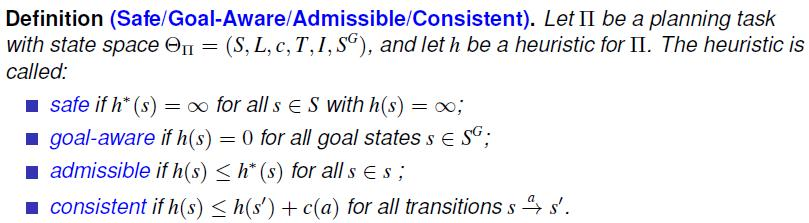

* If h is consistent and goal-aware, then h is admissible.
* If h is admissible, then h is goal-aware.
* If h is admissible, then h is safe.
* No other implications of this form hold.

### Breadth-First Search	L2 P14

* Strategy: Expand nodes in the order they were produced (FIFO frontier).
* Completeness: yes
* Optimality: 
  * Yes, for uniform action costs. Breadth-first search always finds a shallowest goal state. 
  * If costs are not uniform, this is not necessarily optimal.
* Complexity:

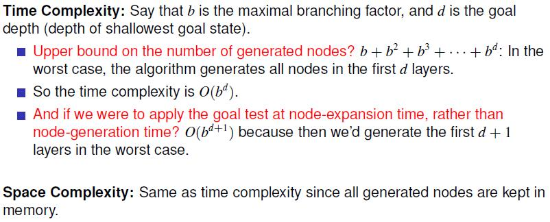

* Which is the worse problem, time or memory?
  * Typically exhausts RAM memory within a few minutes.
* Breadth-first search is optimal but uses exponential space.

#### Depth-First Search	L2 P17

* Strategy: Expand the most recent nodes in (LIFO frontier).
* Completeness: 
  * No, because search branches may be infinitely long: No check for cycles along a branch!
  * Depth-first search is complete in case the state space is acyclic, e.g., Constraint Satisfaction Problems. If we do add a cycle check, it becomes complete for finite state spaces.
* Optimality: No. After all, the algorithm just “chooses some direction and hopes for the best”. 
  * Depth-first search is a way of “hoping to get lucky”.
* Complexity:
  * Space: Stores nodes and applicable actions on the path to the current node. So if m is the maximal depth reached, the complexity is **O(bm)**.
  * Time: If there are paths of length m in the state space, **O(b^m)** nodes can be generated. Even if there are solutions of depth 1!
    * If we happen to choose “the right direction” then we can find a length-l solution in time O(bl) regardless how big the state space is.
* Depth-first search uses linear space but is not optimal.

#### Iterative Deepening Search	L2 P19

* Completeness: yes
* Optimality: yes
* Complexity:
  * Space: O(bd)
  * Time: 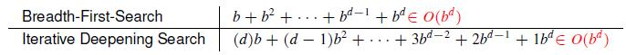

* IDS combines the advantages of breadth-first and depth-first search.
* It is the preferred blind search method in large state spaces with unknown solution depth.

#### Greedy best-first search

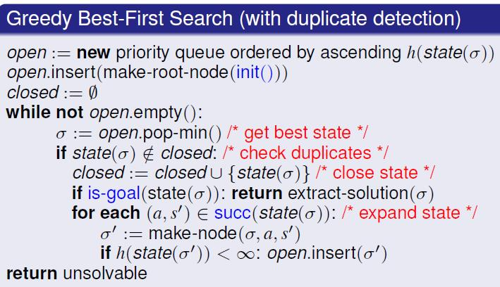

* Completeness: Yes, for safe heuristics. (and duplicate detection to avoid cycles)
* Optimality: No
* Invariant under all strictly monotonic transformations of h 
  * e.g., scaling with a positive constant or adding a constant.
* Priority queue: e.g., a min heap.
* “Check Duplicates”: Could already do in “expand state”; done here after “get best state” only to more clearly point out relation to A.

#### A*	L2 P33

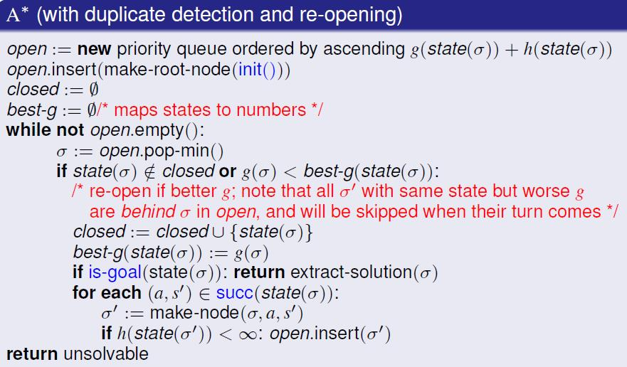

* f -value of a state: defined by f (s) := g(s) + h(s).
* Generated nodes: Nodes inserted into open at some point.
* Expanded nodes: Nodes popped from open for which the test against closed and distance succeeds.
* Re-expanded nodes: Expanded nodes for which state in closed upon expansion (also called re-opened nodes).
* Completeness: Yes, for safe heuristics. (Even without duplicate detection.)
* Optimality: Yes, for admissible heuristics. (Even without duplicate detection.)
* Popular method: break ties (f (s) = f (s')) by smaller h-value.
* If h is admissible and consistent, then A never re-opens a state. So if we know that this is the case, then we can simplify the algorithm.
* Common, hard to spot bug: check duplicates at the wrong point.

#### Weighted A*

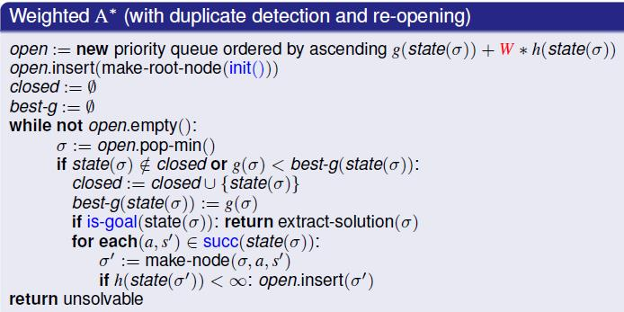

#### Hill-climbing

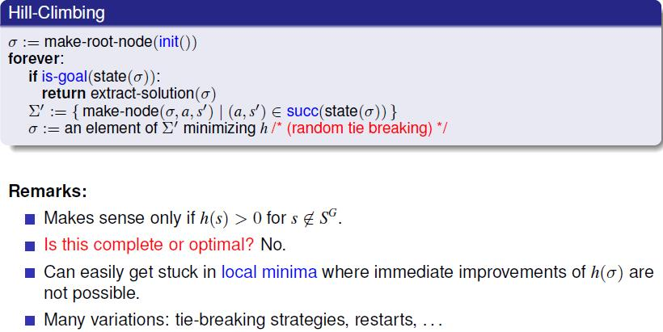

#### Enforced hill-climbing

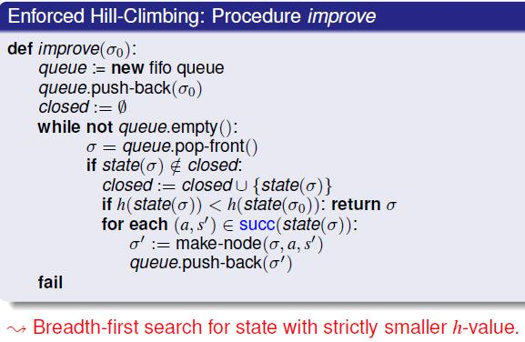

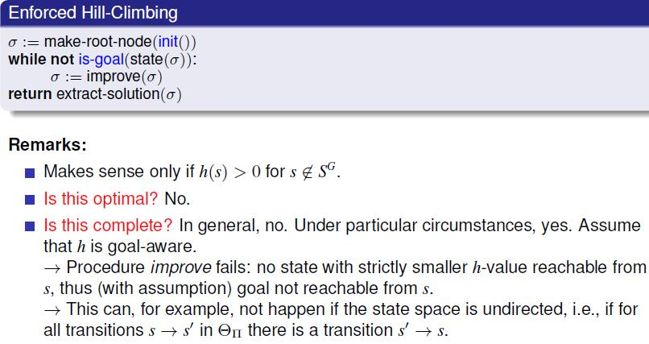

#### Properties of search algorithms

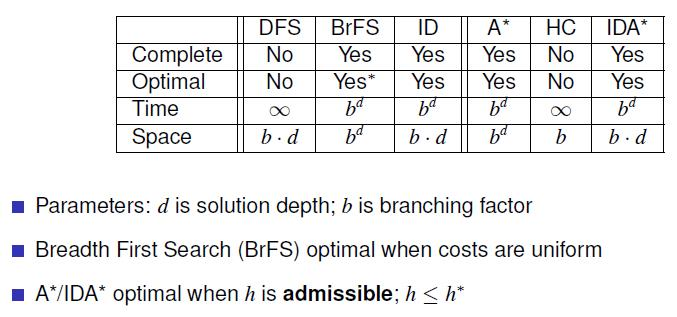

#### Summary

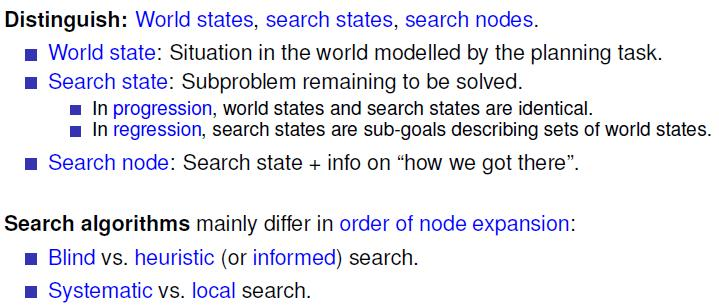

## 题目

#### Quiz

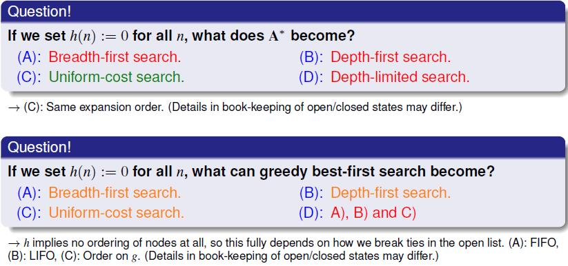

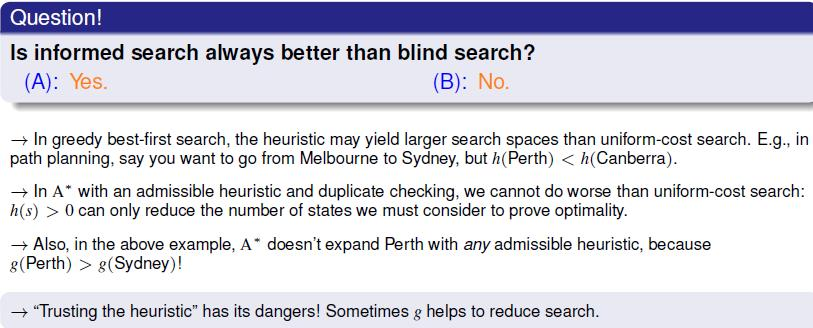

I would encourage you to draw a small graph containing 3 nodes: Melbourne, Sydney and Perth. Start the search in Melbourne, and set Sydney as your goal. Draw the costs of travelling from any pair of cities in hours: Melb-Pert = 30h, Perth-Syd=45h, and Melb-Syd=10h. Test the statements above to check your intuitions.

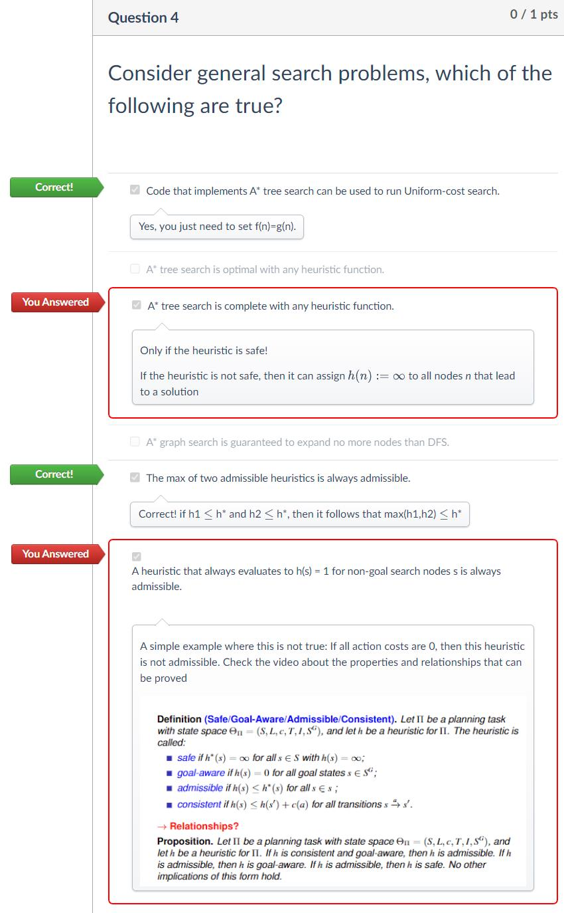

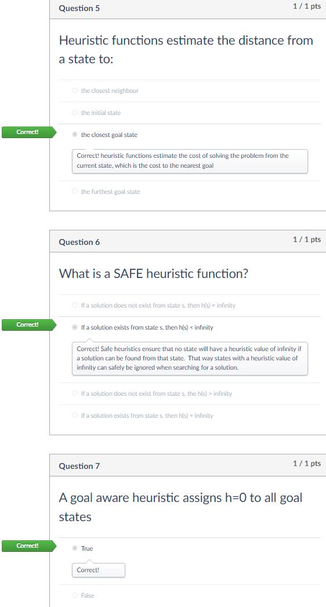

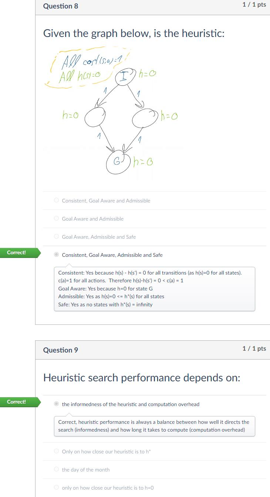

