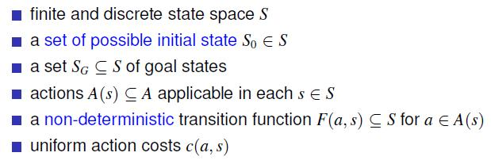

# 3 - Introduction to Planning

## 知识点 & [题目](#题目)

The key problem is to select the action to do next. This is the so-called control problem. Three approaches to this problem:

* Programming-based: Specify control by hand
* Learning-based: Learn control from experience
* Model-based: Specify problem by hand, derive control automatically

Approaches not orthogonal; successes and limitations in each

Different models yield different types of controllers

#### Programming-Based Approach

Control specified by programmer

* Advantage: domain-knowledge easy to express

* Disadvantage: cannot deal with situations not anticipated by programmer

#### Learning-Based Approach

Learns a controller from experience or through simulation

* Unsupervised (Reinforcement Learning):
  * penalize Mario time that 'dies'
  * reward agent each time opponent 'dies' and level is finished
* Supervised (Classification)
  * learn to classify actions into good or bad from info provided by teacher
* Evolutionary
  * from pool of possible controllers: try them out, select the ones that do best, and mutate and recombine for a number of iterations, keeping best
* Advantage: does not require much knowledge in principle
* Disadvantage: in practice, hard to know which features to learn, and is slow

#### Model-Based Approach / General Problem Solving	L3 P10

Specify model for problem: actions, initial situation, goals, and sensors

Let a solver compute controller automatically

Advantage:

* Powerful: In some applications generality is absolutely necessary
* Quick: Rapid prototyping. 10s lines of problem description vs. 1000s lines of C++ code. (Language generation)
* Flexible & Clear: Adapt/maintain the description
* Intelligent & domain-independent: Determines automatically how to solve complex problem effectively!

Disadvantage:

* Efficiency loss: Without any domain-specific knowledge about Chess, you don’t beat Kasparov

Trade-off between ‘automatic and general’ vs. ‘manual work but effective’

Model-based approach to intelligent behavior called Planning in AI

#### Different planning models

**Classical Planning:**	

* A solution is a sequence of applicable actions that maps s0 into SG, and it is optimal if it minimizes sum of action costs (e.g., # of steps)
* Different models and controllers obtained by relaxing assumptions in blue

**Conformant Planning:**

* A solution is still an action sequence but must achieve the goal **for any possible initial state and transition**.
* More complex than classical planning, verifying that a plan is conformant intractable in the worst case; but special case of planning with partial observability.

**Planning with Markov Decision Processes:** MDPs are fully observable, probabilistic state models

* Solutions are functions (policies) mapping states into actions
* Optimal solutions minimize expected cost to goal

**Partially Observable MDPs:** POMDPs are partially observable, probabilistic state models

* Belief states are probability distributions over S
* Solutions are policies that map belief states into actions
* Optimal policies minimize expected cost to go from b0 to G

#### Models, Languages, and Solvers

* A planner is a solver over a class of models; it takes a model description, and computes the corresponding controller
* Many models, many solution forms: uncertainty, feedback, costs, . . .
* Models described in suitable planning languages (Strips, PDDL, PPDDL, . . . ) where states represent interpretations over the language.

#### A Basic Language for Classical Planning: STRIPS	T4

The Blocks world: 

#### PDDL	T4	A2

**PDDL is not a propositional language:**

* Representation is lifted, using object variables to be instantiated from a finite set of objects. (Similar to predicate logic)
* Action schemas parameterized by objects.
* Predicates to be instantiated with objects.

**A PDDL planning task comes in two pieces:**

* The domain file and the problem file.
* The problem file gives the objects, the initial state, and the goal state.
* The domain file gives the predicates and the operators; each benchmark domain has one domain file.

The Blocks World:

* Domain: 

* Problem: 

#### Satisficing vs. Optimal

* Satisficing planning
  * Input: A planning task P.
  * Output: A **plan** for P, or 'unsolvable' if no plan for P exists.
  * By **PlanEx**, we denote the problem of deciding, given a planning task P, whether or not there exists a plan for P.
* Optimal planning
  * Input: A planning task P.
  * Output: An **optimal plan** for P, or 'unsolvable' if no plan for P exist.
  * By **PlanLen**, we denote the problem of deciding, given a planning task P and an integer B, whether or not there exists a plan for P of length at most B.
* The techniques successful for either one of these are almost disjoint!
* Satisficing planning is much more effective in practice
* Programs solving these problems are called (optimal) planners, planning systems, or planning tools.
* PlanEx and PlanLen are PSPACE-complete.
  * At least as hard as any other problem contained in PSPACE.
* In general, PlanEx and PlanLen have the same complexity.
* Within particular applications, bounded length plan existence is often harder than plan existence.
* This happens in many IPC benchmark domains: PlanLen is NP-complete while PlanEx is in P.
  * For example: Blocksworld and Logistics.
* In practice, optimal planning is (almost) never ‘easy’

#### NP & PSPACE: 

#### Computation

Key issue: exploit two roles of language

* specification: concise model description
* computation: reveal useful heuristic information (structure)

Two traditional approaches: search vs. decomposition

* explicit search of the state model S(P) direct but not effective til recently
* near decomposition of the planning problem thought a better idea

State of the Art in Classical Planning

* significant progress since Graphplan
* empirical methodology
  * standard PDDL language
  * planners and benchmarks available; competitions
  * focus on performance and scalability
* large problems solved (non-optimally)
* different formulations and ideas
  * Planning as Heuristic Search
  * Planning as SAT (Satisfiability)
  * Other: Local Search (LPG), Monte-Carlo Search, . . .

#### Summary

* General problem solving attempts to develop solvers that perform well across a large class of problems.
* Planning, as considered here, is a form of general problem solving dedicated to the class of classical search problems. 
  * Actually, we also address inaccessible, stochastic, dynamic, continuous, and multi-agent settings.
* Classical search problems require to find a path of actions leading from an initial state to a goal state.
  * They assume a single-agent, fully-observable, deterministic, static environment. Despite this, they are ubiquitous in practice.
* Heuristic search planning has dominated the International Planning Competition (IPC). We focus on it here.
* STRIPS is the simplest possible, while reasonably expressive, language for our purposes. It uses Boolean variables (facts), and defines actions in terms of precondition, add list, and delete list.
* Plan existence (bounded or not) is PSPACE-complete to decide for STRIPS.
* PDDL is the de-facto standard language for describing planning problems.

## 题目

**Quiz**

