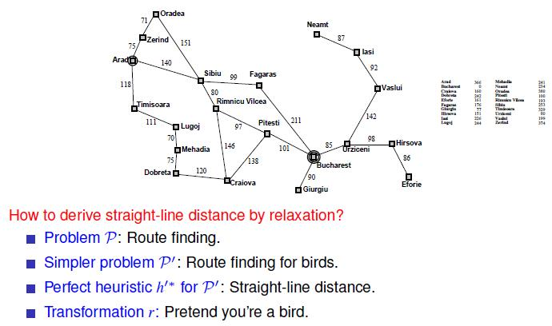
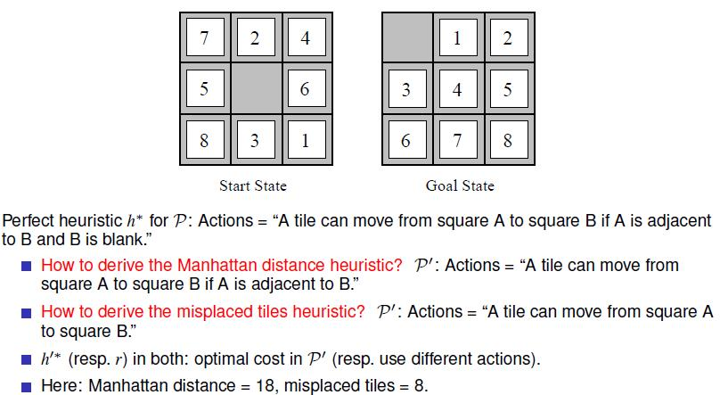
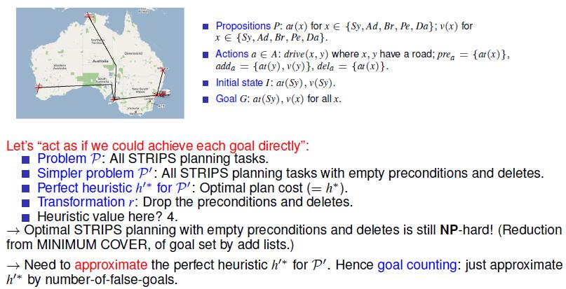
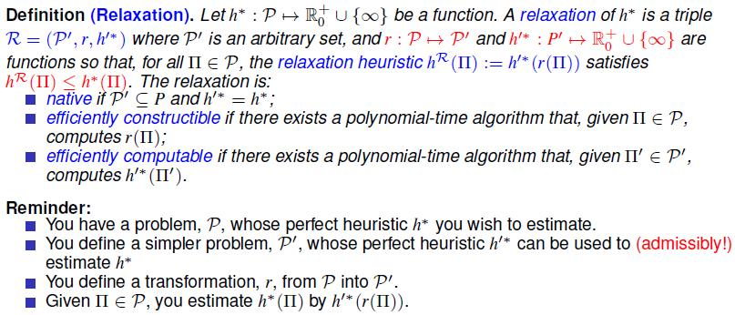
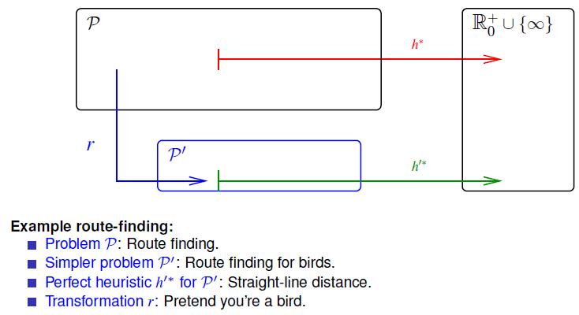
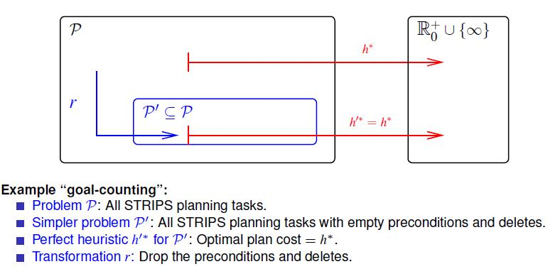
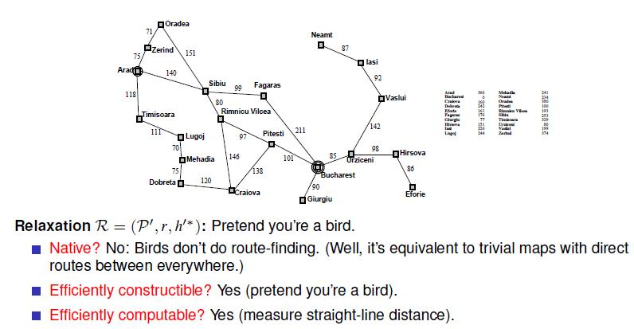
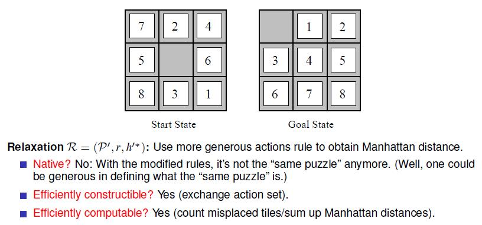
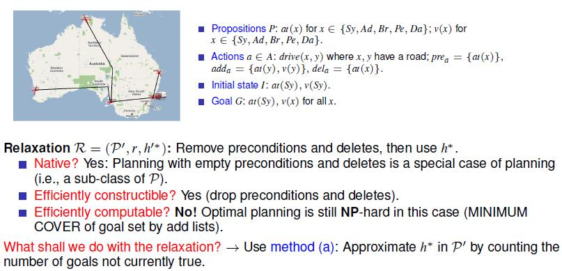
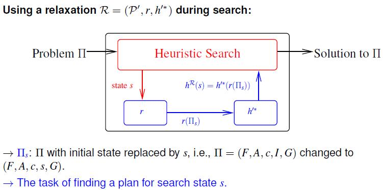

# 4 - Generating Heuristic Functions

## 知识点 & [题目](#题目)

#### Relaxing is a methodology to construct heuristic functions.

* Relaxation means to simplify the problem, and take the solution to the simpler problem as the heuristic estimate for the solution to the actual problem.

#### Relaxations

#### How to Relax During Search: Illustration

* Goal-Counting	L4 P21
  * The goal-counting approximation h =“count the number of goals currently not true” is a very **uninformative** heuristic function:
    * Range of heuristic values is small (0 - |G|).
    * We can transform any planning task into an equivalent one where h(s) = 1 for all non-goal states s. 
      * How? Replace goal by new fact g and add a new action achieving g with precondition G.
    * Ignores almost all structure: Heuristic value does not depend on the actions at all.
    * Is h safe/goal-aware/admissible/consistent? Only **safe and goal-aware**.
* Ignoring Deletes    L4 P22    More useful

#### Summary

* Relaxation is a method to compute heuristic functions.
* Given a problem P we want to solve, we define a relaxed problem P'.
  * We derive the heuristic by mapping into P' and taking the solution to this simpler problem as the heuristic estimate.
* Relaxations can be native, efficiently constructible, and/or efficiently computable.
  * None of this is a strict requirement to be useful.
* During search, the relaxation is used only inside the computation of the heuristic function on each state; the relaxation does not affect anything else. 
  * This can be a bit confusing especially for native relaxations like ignoring deletes.

## 题目

#### Quiz

#### 

#### 