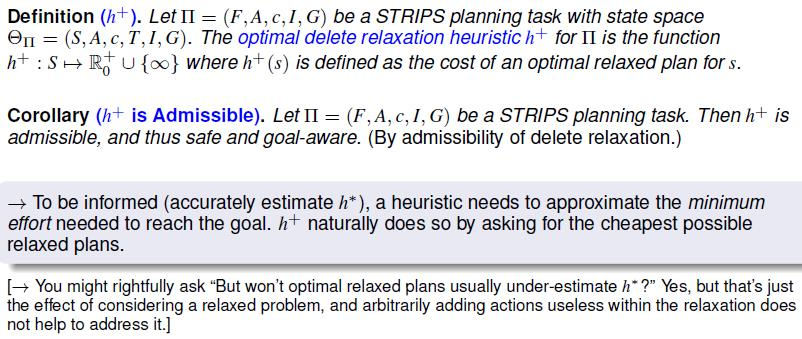
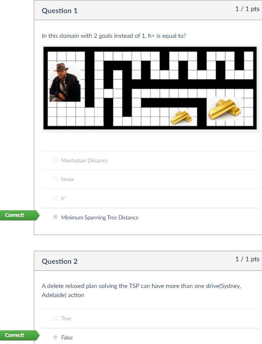

# 5 - Delete Relaxation Heuristics

## 知识点 & [题目](#题目)

Delete relaxation is a method to relax planning tasks, and thus automatically compute heuristic functions h.

Every h yields good performance only in some domains! (Search reduction vs. computational overhead)

Relaxed world: "What was once true remains true forever."

**A Relaxed plan for "TSP" in Australia:**

#### **Delete Relaxation & State Dominance**

The delete relaxation is aka ignoring delete lists.

#### **Greedy Relaxed Planning**

#### **The optimal delete relaxation heuristic**

​					**h+(TSP) = Minimum Spanning Tree**

​					h+(Hanoi) = n, not 2n	L5 P16

​				**Theorem (Optimal Relaxed Planning is Hard): PlanOpt+ is NP-complete.**	Proof: L5 P17

**Not efficiently computable:**

* (a) approximate h'*
* (b) design h'* in a way so that it will typically be feasible
* (c) just live with it and hope for the best
  * Many known relaxations (in planning) are efficiently computable, some aren’t. The latter use (a).
  * (b) and (c) are not used anywhere right now.
* The delete relaxation heuristic we want is h+. Unfortunately, this is hard to compute so the computational overhead is very likely to be prohibitive. All implemented systems using the delete relaxation approximate h+ in one or the other way.

#### *<u>The Additive and Max Heuristics</u>*

#### Bellman-Ford for  and hadd

**hmax in "TSP" in Australia**

**hadd in "TSP" in Australia**

**hadd in "Logistics"**

#### Relaxed Plans: Reduce over-counting

* Expanding only helpful actions does not guarantee completeness.
* Other planners use helpful actions as preferred operators, expanding first nodes resulting from helpful actions.

#### Summary

#### 

## 题目

### Quiz

