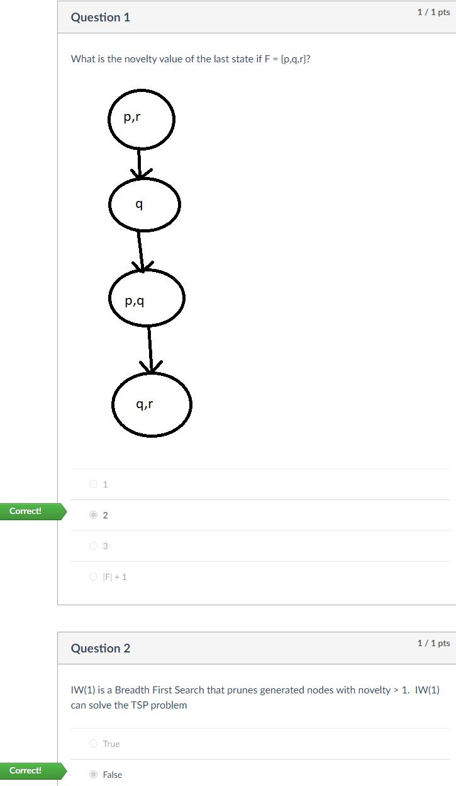

# 6 - Width Based Planning, Plan & Goal Recognition

## 知识点 & [题目](#题目)

### Width Based Planning

##### A new width notion and planning algorithm exponential in problem width:

* Benchmark domains have small width when goals restricted to single atoms
* Joint goals easy to serialize into a sequence of single goals

##### Do you want Hard Problems?

* problems with high atomic width (apparently no benchmark in this class)
* multiple goal problems that are not easy to serialize (e.g. Sokoban)

#### 

* **atoms -> facts F**
* Novelty table

#### Iterated Width (IW)

#### 

* While simple and blind, performs well over benchmarks when goals restricted to single atoms
* This is no accident, width of benchmarks domains is small for such goals

#### 

**Serialized Iterated Width (SIW)**

* Simple way to use IW for solving real benchmarks P with joint goals is by simple form of “hill climbing” over goal set G with |G| = n, achieving atomic goals one at a time
* SIW uses IW for both decomposing a problem into subproblems and for solving subproblems
* It’s a blind search procedure, no heuristic of any sort, IW does not even know next goal Gi “to achieve”

**IW: sequence of novelty-based pruned breadth-first searches**

* Experiments: excellent when goals restricted to atomic goals
* Theory: such problems have low width w and IW runs in time O(nw)

**SIW: IW serialized, used to attain top goals one by one**

* Experiments: faster, better coverage and much better plans than GBFS planner with hadd
* Intuition: goals easy to serialize and have atomic low width w

#### Balancing exploration and exploitation

State-of-the-art methods for satisficing planning rely on:

* heuristics derived from problem
* plugged into Greedy Best-First Search (GBFS)
* extensions (like helpful actions and landmarks)

**GBFS is pure greedy “exploitation”; often gets stuck in local minima**

* Recent approaches improve performance by adding exploration

Exploration required for optimal behavior in RL and MCTS

* Such methods perform flat exploration that ignores structure of states

##### Best-First Width Search (BFWS)

#### 

#### Models and Simulators

##### Simulators: without a representation of action preconditions and effects

* Developing a planner that uses action structure only to define
  * the set A(s) of applicable actions in state s
  * state transition function f(a,s)
* The planner does not see action preconditions and effects but just the functions A(s) and f(a,s)
* Its performance matches the performance of state of the art planners that make use of PDDL representations, over the existing PDDL benchmarks

##### Modelling

Many problems fitting classical planning model but difficult to describe in PDDL are easily modeled now: Pacman, Tetris, Pong, etc.

* Expressive language features easily supported: functions, conditional effects, derived predicates, state constraints, quantification, ...
* Any element of the problem can be modeled through logical symbols attached to external procedures (e.g. C++).
* Action effects can be given as fully-black-box procedure taking the state as input.
* Many problems fit Classical Planning model, but hard to express in declarative languages.

Simulated BFWS	L6 P25

* No need for planning languages that reveal structure of actions (e.g. action preconditions and effects)
* Not much efficiency appears to be lost in second pathway

Challenges

* Non-linear dynamics
* Perturbation in flight controls
* Partial observability
* Uncertainty about opponent strategy

Classical Planning with Simulators	L6 P29

### Plan & Goal Recognition

**Plan Recognition (PR) is Planning in reverse**

* Planning - we seek plans to achieve goals G.
* PR: find goals G accounting for partially observed plan.

Formalising GR as a Multi-Agent Task

* Two possible roles for each agent:
  * Actor - performs actions to change the state of the world
  * Observer - perceives actions and updates its belief on the Actor intentions
* Three possible stances for the Actor
  * Adversarial - obfuscates deliberately its goals
  * Cooperative - tries to tell the Observer what she is up to
  * Indifferent - does not care about the Observer
* Open Challenge: Stances could be changing over time

**Components of Goal Recognition Task**

* Actions describe what the Actor does
  * Walking from X to Y , opening a door, using a credit card...
* Goals describe what the Actor wants
  * To have breakfast, Park a car, Wreck a web service...
* Plans describe how goals can be achieved
  * Ordered sequences of actions
  * These can be ranked according to cost or efficiency
* Sensor Model describes what does the Observer perceives
  * Does it always see every action done by the Actor?
  * Are actions observed directly? Or only their effects are?
  * Does it know exactly where in the world the Actor is?
* Goal Recognition can be modeled using STRIPS

**Example: Agent on a Grid World	L6B P14**

#### 

##### **Key facts of the Model-Based Approach**

#### 

**Roadmap**

* Make off-the-shelf (现成的) planners compute constrained w.r.t (with reference to) O
* Derive P(G|O) from best plans that comply with and work around O

##### **PR as planning: Inferring the Goal Probabilities**

#### 

* cost to not complying with observations - cost to comply with observations

##### Goals as Predictors for O (informally)

* G predicts O badly when it would be more efficient to deviate from O.
* G predicts O perfectly when G unfeasible if not doing O.

## 题目

### Quiz

#### 

