# 7 - MDPs and Value Iteration

## 知识点 & [题目](#题目)

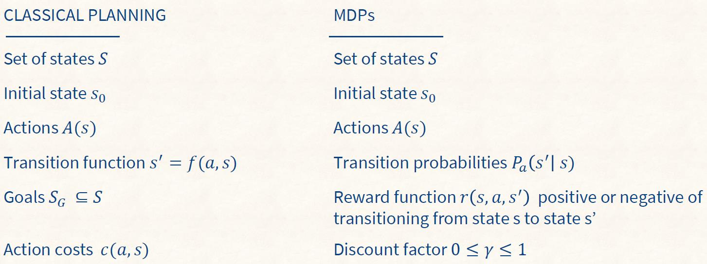

#### Policies: Deterministic vs. Stochastic

Deterministic: pi(s) -> A. Given state s, the policy pi is a function that maps states to actions.

* It specifies which action to choose in every possible state.
* Thus, if we are in state s, our agent should choose the action defined by π(s).

Stochastic: pi(s, a) S * A -> R. Given a state s and action a, returns the probability that action a will be selected in s. Intuitively, π(s, a) specifies the probability that action a should be executed in state s.

#### *<u>Optimal solutions to MDPs: The Bellman Equation (Discounted-Reward MDPs)</u>*

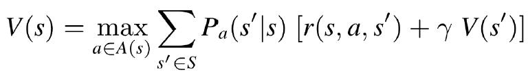

#### <u>*Solving MDPs with Dynamic Programming: Value Iteration*</u>

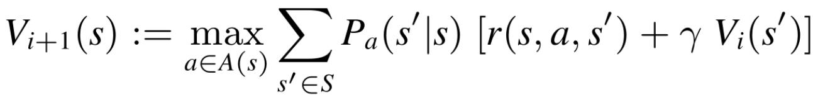

#### 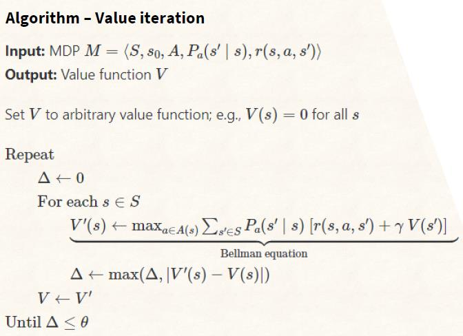

##### O(|S|^2 |A| n)	L7 P16

#### Policy extraction: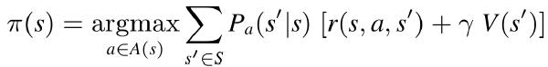

#### Summary

* We covered Markov Decision Processes (MDPs). They differ from classical planning in that **actions can have more than one possible outcome**. Each outcome has an associated probability.
* The optimal policy can be computed through value iteration, which is based on dynamic programming. Specifically, it uses the Bellman equations to iteratively improve on a non-optimal solution.
* We looked at how to extract policies from value functions derived by value iteration.

## 题目

### Quiz

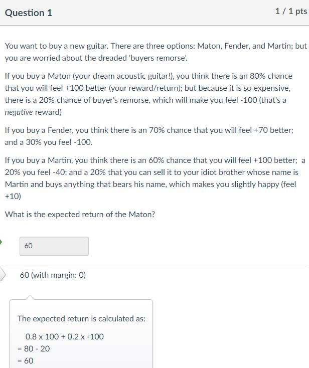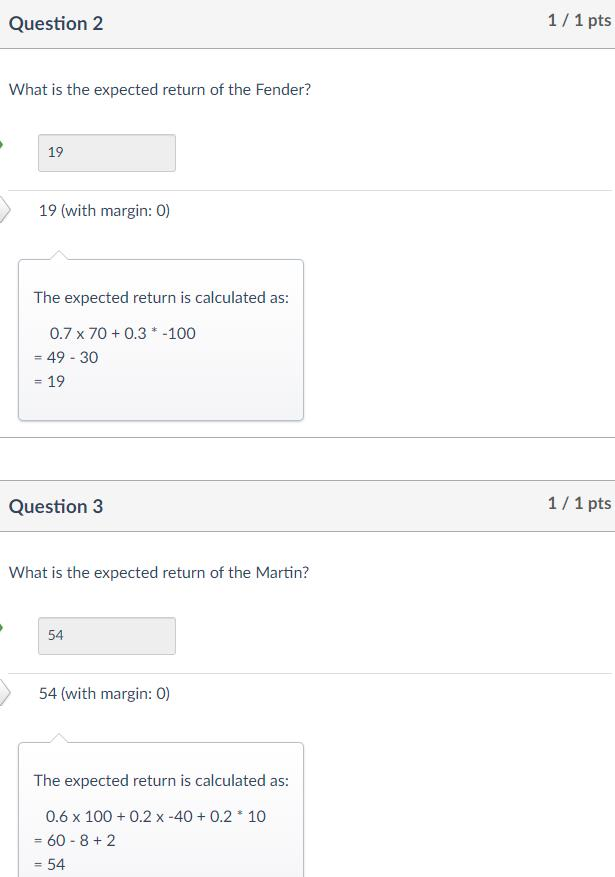

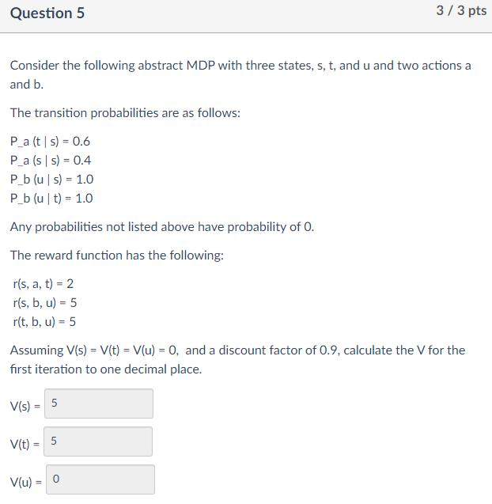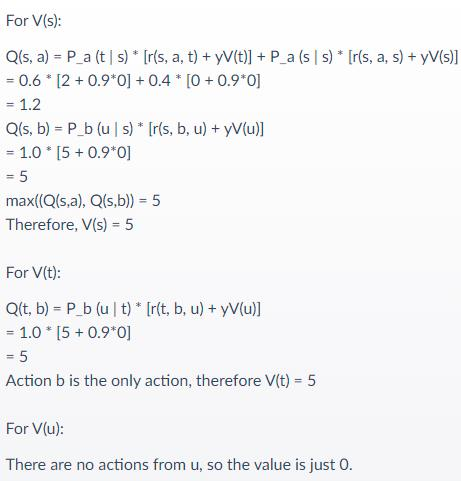

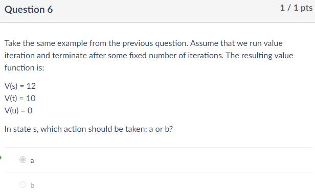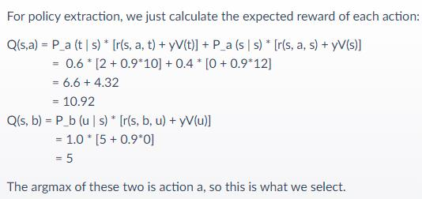

