# 8 - Multi-Armed Bandits & TD Learning

## 知识点 & [题目](#题目)

### Multi-Armed Bandits

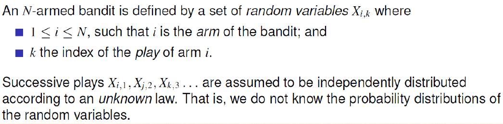

Intuition: actions *a* applicable on *s* are the "arms of the bandit", and Q(s, a) corresponds to the random variables Xi,n.

##### Regret: L8.1 P7

**Exploration: e.g. select a random action**

**Exploitation: Use learned information to make selection**

#### Epsilon greedy

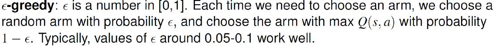

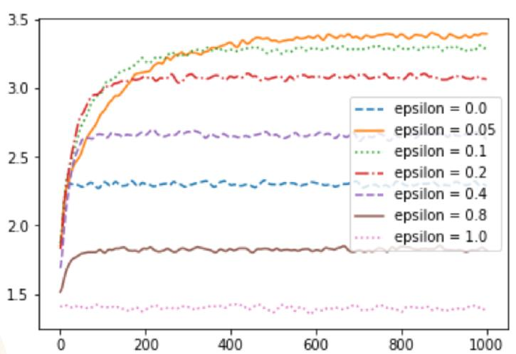

#### Epsilon decreasing

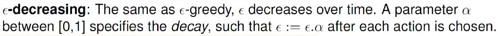

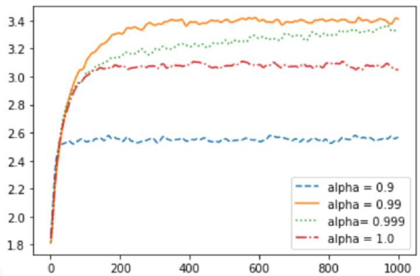

* increase alpha -> reduce number of explorations
* Gain more info -> explore less / exploit more

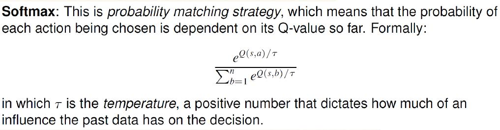

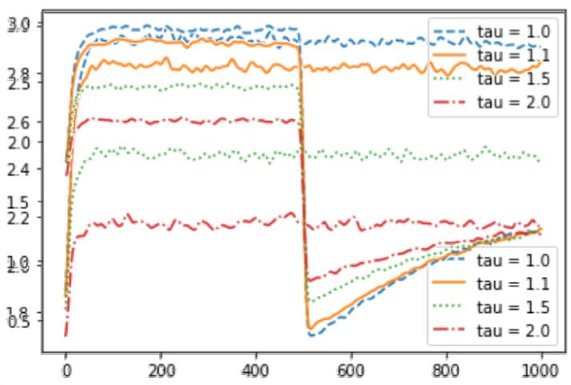

* At step 500, probabilities are changed and old information are not useful.
* Tao =1.0 recovers the fastest because more likely to sample actions previously bad but now good.

#### Upper Confidence Bounds

#### 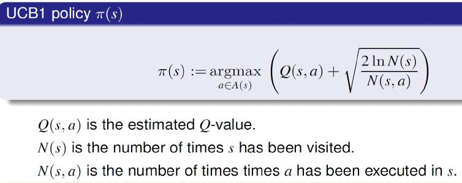

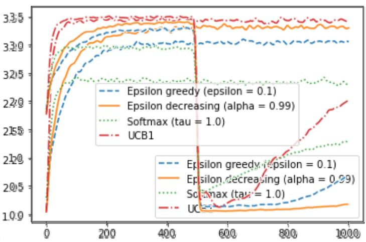

* Upper Confidence Bounds (UCB1) for Multi-Armed Bandits makes a good selection policy.
* UCB1 (with slight modifications) balances exploitation and exploration remarkable well.
* The Fear Of Missing Out is an excellent motivator for exploration.

### TD Learning

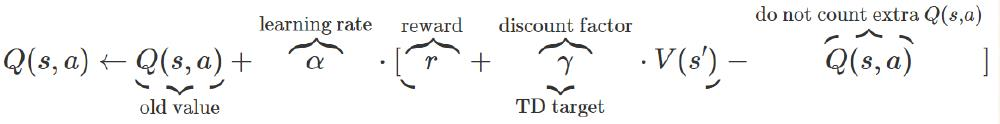

* alpha = [0, 1]
* [part] -> TD estimate
* V(s') = maxa' Q(s', a')

#### Off-Policy TD: Q-Learning	EX L8.2 P9

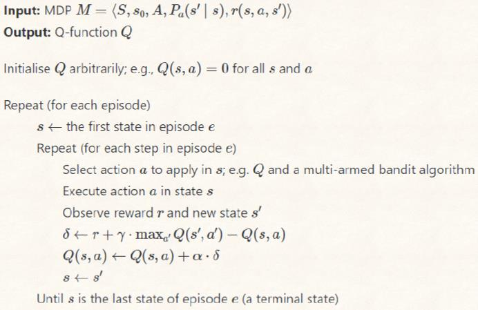

#### On-Policy TD: SARSA

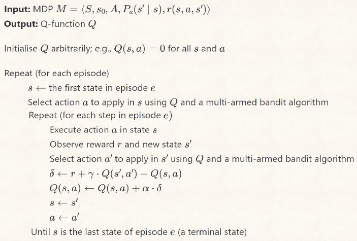

#### SARSA vs. Q-Learning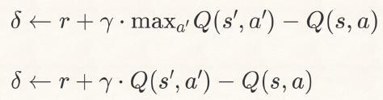

* **Off-Policy: Prior experience**
* **On-Policy: Learning on the job**

* Limitations
  * Finite number of states and actions
  * Unavailable on continuous actions
  * Q-table requires huge memory

## 题目

### Quiz

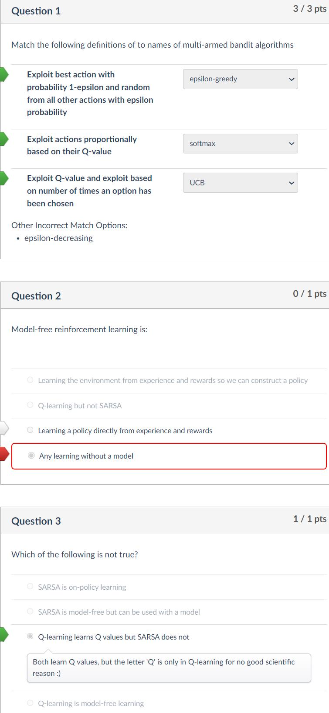

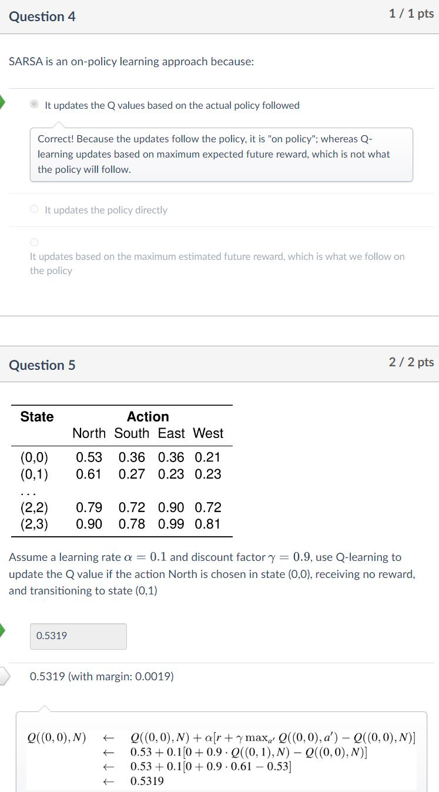

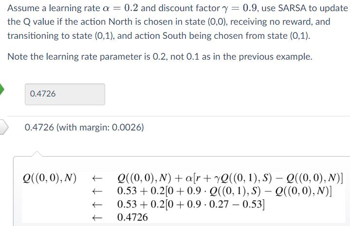