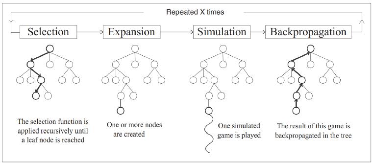

# 9 - MCTS & Reward Shaping & Q-Function Approximation

## 知识点 & [题目](#题目)

### MCTS

##### Value iteration and TD learning work will in some situations, however

* Value iteration learns a policy, but it requires a model; and also learns a policy for every state → lots of states, X
* TD-learning learns a policy, but really only works well for repetitive tasks OR requires extensive training (e.g. up to weeks) → cannot react to things that were not explored a lot!

They are both **offline methods**: policies must be trained in advance.

##### MCTS: Similar to Monte-Carlo reinforcement learning (based on simulation), but uses a tree to prioritise more favourable moves

##### MCTS Foundation: MDPs as Expecti-Max Trees

##### MCTS Overview

##### Example

##### Upper Confidence Trees: effective as the multi-armed bandit

UCT = MCTS + UCB1

##### MCTS Large Example	L9.1 P9

MCTS is particularly effective in massive state/search spaces when resources and time are not available.

### Reward Shaping

#### Example

#### Q-Function Initialisation

* Small, ‘fake’ rewards can frequently be easily defined using domain knowledge.
* If defined as a potential functions, guaranteed to converge.
* A well defined potential function can significantly reduce the length of episodes early in learning.
* Q-function initialisation - similar technique, shown to have equivalent outcomes if potential function is static.

### Q-Function Approximation

##### Using Q-function approximation, we can scale reinforcement learning by approximating Q functions, rather than storing complete Q tables.

#### Linear Q-Function Approximation

##### Use simple linear methods in which we select features and learn weights are effective and guarantee convergence.

##### Representation:

##### Update:

* w: weight

##### Example: Freeway	L9.3 P5

##### Defining state-action features

#### Deep Q-Learning

##### Offers alternatives in which we do not need to select features, making it more suitable for unstructured data. But requires more training data (more episodes) and has no convergence guarantees.

* theta - > gradient

#### Strengths ✔ & Limitations ❌

**Q-function approximation**

* Compact representation ✔
* Q-value propagation ✔
* They are approximations ❌

**Linear**

* Convergence ✔

**Deep**

* Minimal feature engineering ✔
* Unstructured input ✔
* Data hungry (high sampling complexity) ❌

## 题目

### Quiz

